# Architecture Documentation

## Overview

The Neo4j Aircraft Data Client is designed with simplicity, modularity, and best practices in mind. This document describes the architecture, design decisions, and component interactions.

## Design Principles

1. **Simplicity First** - Easy to understand and extend
2. **Type Safety** - Leverage Python type hints and Pydantic validation
3. **Separation of Concerns** - Clear boundaries between layers
4. **Security** - Parameterized queries, input validation
5. **Testability** - Mock-friendly design with dependency injection

## System Architecture

### High-Level Component Diagram

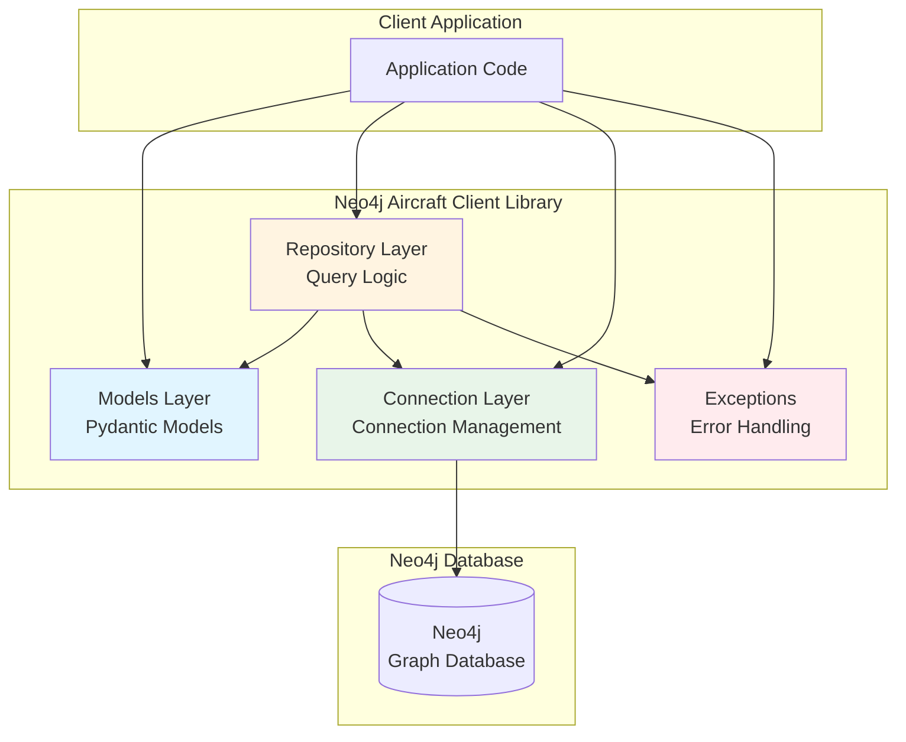
```mermaid
graph TB
    subgraph "Client Application"
        APP[Application Code]
    end
    
    subgraph "Neo4j Aircraft Client Library"
        MODELS[Models Layer<br/>Pydantic Models]
        REPO[Repository Layer<br/>Query Logic]
        CONN[Connection Layer<br/>Connection Management]
        EXC[Exceptions<br/>Error Handling]
    end
    
    subgraph "Neo4j Database"
        DB[(Neo4j<br/>Graph Database)]
    end
    
    APP --> MODELS
    APP --> REPO
    APP --> CONN
    APP --> EXC
    
    REPO --> MODELS
    REPO --> CONN
    REPO --> EXC
    
    CONN --> DB
    
    style MODELS fill:#e1f5ff
    style REPO fill:#fff4e1
    style CONN fill:#e8f5e9
    style EXC fill:#ffebee
```

### Layer Responsibilities

#### Models Layer (`models.py`)
- Define data structures using Pydantic
- Provide type validation and serialization
- Document entity schemas with field descriptions
- No business logic or database operations

#### Repository Layer (`repository.py`)
- Implement repository pattern for each entity type
- Encapsulate Cypher query logic
- Return typed model instances
- Handle query execution errors

#### Connection Layer (`connection.py`)
- Manage Neo4j driver lifecycle
- Provide session management
- Support context manager protocol
- Handle connection errors

#### Exceptions Layer (`exceptions.py`)
- Define custom exception hierarchy
- Provide clear error types for different failure modes
- Enable proper error handling in applications

## Package Structure

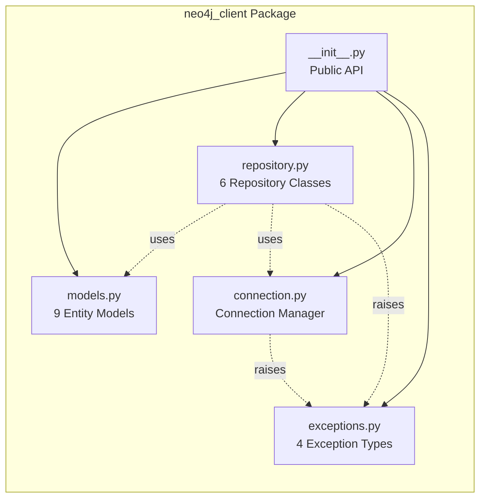
```mermaid
graph LR
    subgraph "neo4j_client Package"
        INIT[__init__.py<br/>Public API]
        MOD[models.py<br/>9 Entity Models]
        REP[repository.py<br/>6 Repository Classes]
        CON[connection.py<br/>Connection Manager]
        EXC[exceptions.py<br/>4 Exception Types]
    end
    
    INIT --> MOD
    INIT --> REP
    INIT --> CON
    INIT --> EXC
    
    REP -.uses.-> MOD
    REP -.uses.-> CON
    REP -.raises.-> EXC
    CON -.raises.-> EXC
```

## Data Flow

### Query Execution Flow

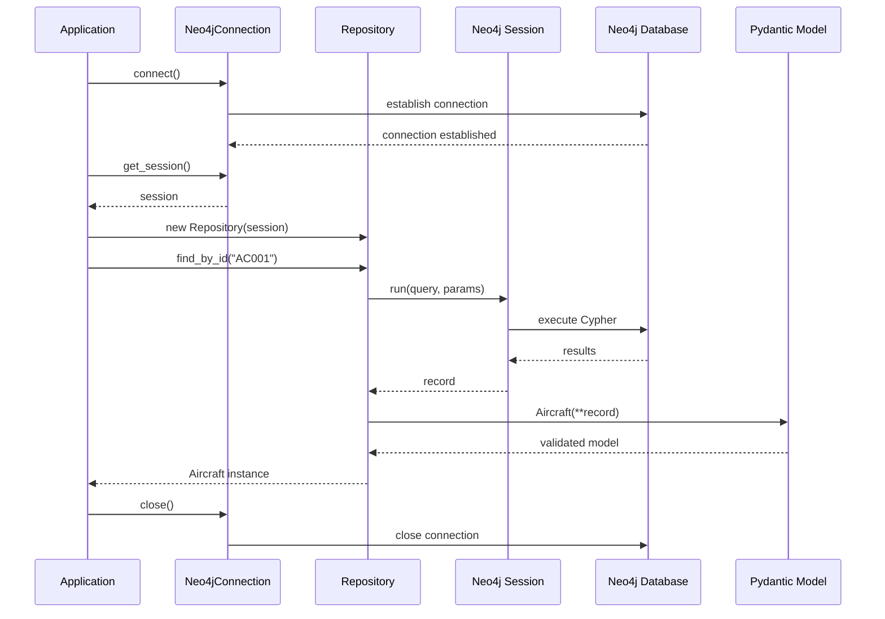
```mermaid
sequenceDiagram
    participant App as Application
    participant Conn as Neo4jConnection
    participant Repo as Repository
    participant Session as Neo4j Session
    participant DB as Neo4j Database
    participant Model as Pydantic Model
    
    App->>Conn: connect()
    Conn->>DB: establish connection
    DB-->>Conn: connection established
    
    App->>Conn: get_session()
    Conn-->>App: session
    
    App->>Repo: new Repository(session)
    App->>Repo: find_by_id("AC001")
    
    Repo->>Session: run(query, params)
    Session->>DB: execute Cypher
    DB-->>Session: results
    Session-->>Repo: record
    
    Repo->>Model: Aircraft(**record)
    Model-->>Repo: validated model
    Repo-->>App: Aircraft instance
    
    App->>Conn: close()
    Conn->>DB: close connection
```

## Repository Pattern

### Repository Design

Each repository class follows a consistent pattern:

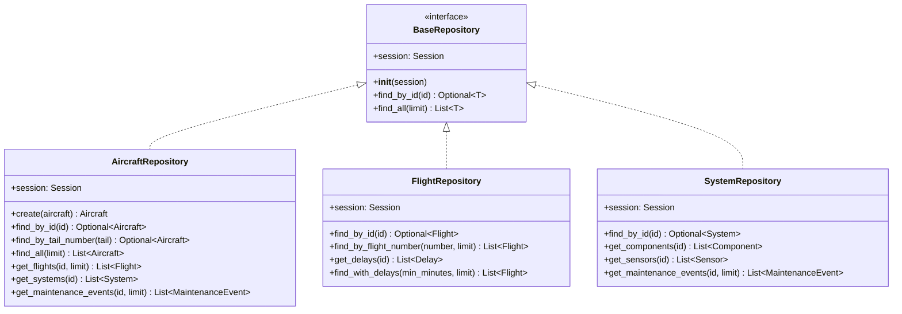
```mermaid
classDiagram
    class BaseRepository {
        <<interface>>
        +session: Session
        +__init__(session)
        +find_by_id(id) Optional~T~
        +find_all(limit) List~T~
    }
    
    class AircraftRepository {
        +session: Session
        +create(aircraft) Aircraft
        +find_by_id(id) Optional~Aircraft~
        +find_by_tail_number(tail) Optional~Aircraft~
        +find_all(limit) List~Aircraft~
        +get_flights(id, limit) List~Flight~
        +get_systems(id) List~System~
        +get_maintenance_events(id, limit) List~MaintenanceEvent~
    }
    
    class FlightRepository {
        +session: Session
        +find_by_id(id) Optional~Flight~
        +find_by_flight_number(number, limit) List~Flight~
        +get_delays(id) List~Delay~
        +find_with_delays(min_minutes, limit) List~Flight~
    }
    
    class SystemRepository {
        +session: Session
        +find_by_id(id) Optional~System~
        +get_components(id) List~Component~
        +get_sensors(id) List~Sensor~
        +get_maintenance_events(id, limit) List~MaintenanceEvent~
    }
    
    BaseRepository <|.. AircraftRepository
    BaseRepository <|.. FlightRepository
    BaseRepository <|.. SystemRepository
```

### Query Patterns

All repositories follow these patterns:

1. **Parameterized Queries** - Use `$param` syntax, never string interpolation
2. **Type-Safe Returns** - Always return Pydantic models or `None`
3. **Error Handling** - Catch exceptions and raise `QueryError`
4. **Limited Results** - Default `limit` parameter to prevent excessive data

Example:

```python
def find_by_id(self, aircraft_id: str) -> Optional[Aircraft]:
    """Find aircraft by ID with parameterized query."""
    query = """
    MATCH (a:Aircraft {aircraft_id: $aircraft_id})
    RETURN a
    """
    result = self.session.run(query, aircraft_id=aircraft_id)
    record = result.single()
    if record:
        return Aircraft(**record["a"])
    return None
```

## Entity Relationship Model

### Domain Model

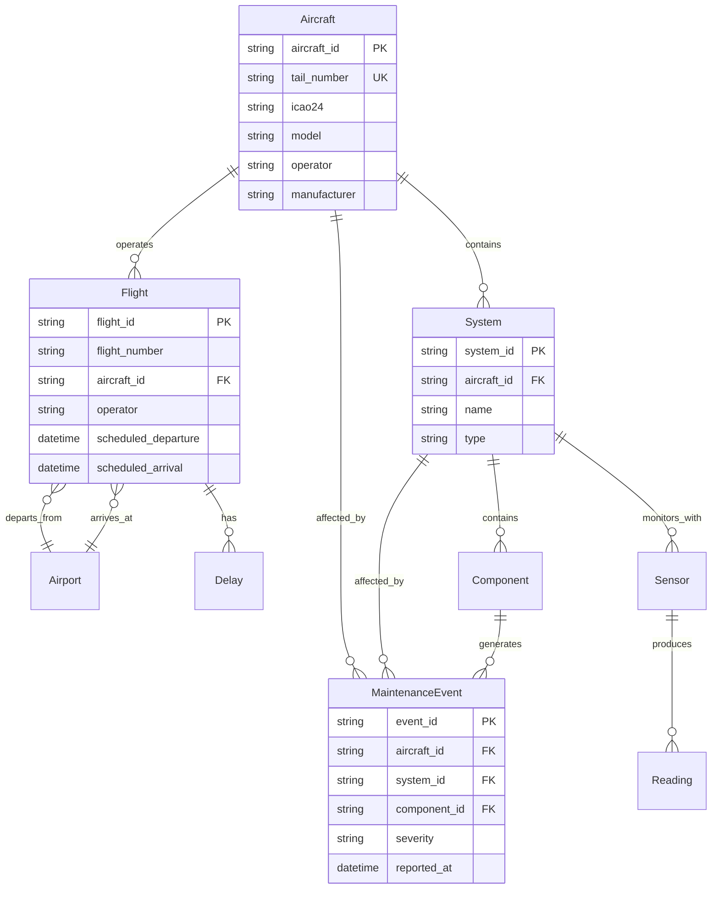
```mermaid
erDiagram
    Aircraft ||--o{ Flight : operates
    Aircraft ||--o{ System : contains
    Aircraft ||--o{ MaintenanceEvent : affected_by
    
    Flight }o--|| Airport : departs_from
    Flight }o--|| Airport : arrives_at
    Flight ||--o{ Delay : has
    
    System ||--o{ Component : contains
    System ||--o{ Sensor : monitors_with
    System ||--o{ MaintenanceEvent : affected_by
    
    Component ||--o{ MaintenanceEvent : generates
    
    Sensor ||--o{ Reading : produces
    
    Aircraft {
        string aircraft_id PK
        string tail_number UK
        string icao24
        string model
        string operator
        string manufacturer
    }
    
    Flight {
        string flight_id PK
        string flight_number
        string aircraft_id FK
        string operator
        datetime scheduled_departure
        datetime scheduled_arrival
    }
    
    System {
        string system_id PK
        string aircraft_id FK
        string name
        string type
    }
    
    MaintenanceEvent {
        string event_id PK
        string aircraft_id FK
        string system_id FK
        string component_id FK
        string severity
        datetime reported_at
    }
```

### Graph Schema

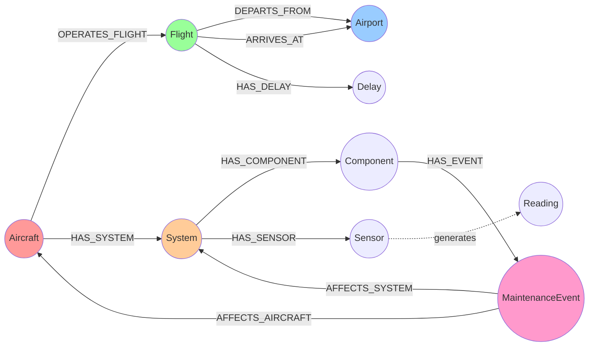
```mermaid
graph LR
    A((Aircraft))
    F((Flight))
    AP((Airport))
    S((System))
    C((Component))
    SE((Sensor))
    R((Reading))
    M((MaintenanceEvent))
    D((Delay))
    
    A -->|OPERATES_FLIGHT| F
    A -->|HAS_SYSTEM| S
    
    F -->|DEPARTS_FROM| AP
    F -->|ARRIVES_AT| AP
    F -->|HAS_DELAY| D
    
    S -->|HAS_COMPONENT| C
    S -->|HAS_SENSOR| SE
    
    C -->|HAS_EVENT| M
    M -->|AFFECTS_AIRCRAFT| A
    M -->|AFFECTS_SYSTEM| S
    
    SE -.generates.-> R
    
    style A fill:#ff9999
    style AP fill:#99ccff
    style F fill:#99ff99
    style S fill:#ffcc99
    style M fill:#ff99cc
```

## Connection Management

### Connection Lifecycle

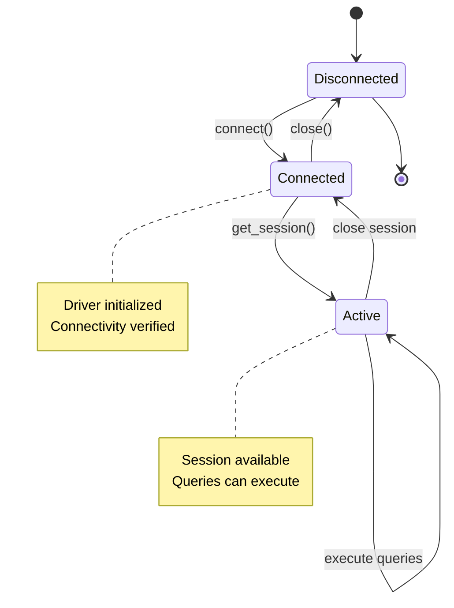
```mermaid
stateDiagram-v2
    [*] --> Disconnected
    Disconnected --> Connected: connect()
    Connected --> Active: get_session()
    Active --> Active: execute queries
    Active --> Connected: close session
    Connected --> Disconnected: close()
    Disconnected --> [*]
    
    note right of Connected
        Driver initialized
        Connectivity verified
    end note
    
    note right of Active
        Session available
        Queries can execute
    end note
```

### Context Manager Support

The `Neo4jConnection` class supports Python's context manager protocol:

```python
with Neo4jConnection(uri, user, password) as conn:
    session = conn.get_session()
    # Use session
    # Automatic cleanup on exit
```

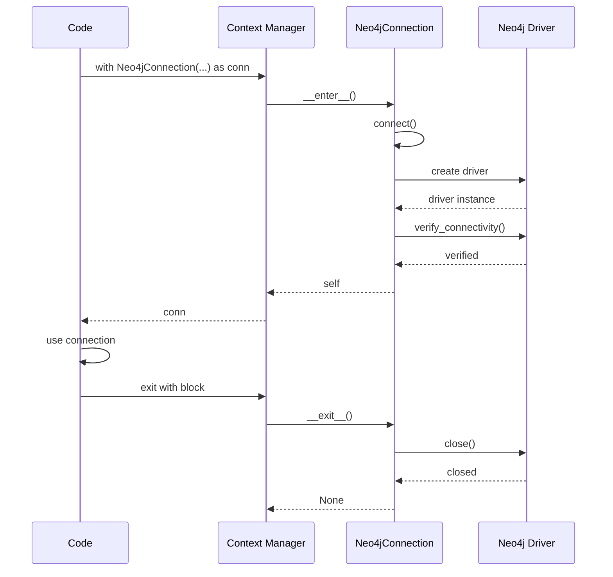
```mermaid
sequenceDiagram
    participant Code
    participant Context as Context Manager
    participant Conn as Neo4jConnection
    participant Driver as Neo4j Driver
    
    Code->>Context: with Neo4jConnection(...) as conn
    Context->>Conn: __enter__()
    Conn->>Conn: connect()
    Conn->>Driver: create driver
    Driver-->>Conn: driver instance
    Conn->>Driver: verify_connectivity()
    Driver-->>Conn: verified
    Conn-->>Context: self
    Context-->>Code: conn
    
    Code->>Code: use connection
    
    Code->>Context: exit with block
    Context->>Conn: __exit__()
    Conn->>Driver: close()
    Driver-->>Conn: closed
    Conn-->>Context: None
```

## Security Architecture

### Query Parameterization

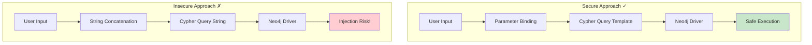
```mermaid
graph TB
    subgraph "Secure Approach ✓"
        S1[User Input] --> S2[Parameter Binding]
        S2 --> S3[Cypher Query Template]
        S3 --> S4[Neo4j Driver]
        S4 --> S5[Safe Execution]
    end
    
    subgraph "Insecure Approach ✗"
        U1[User Input] --> U2[String Concatenation]
        U2 --> U3[Cypher Query String]
        U3 --> U4[Neo4j Driver]
        U4 --> U5[Injection Risk!]
    end
    
    style S5 fill:#c8e6c9
    style U5 fill:#ffcdd2
```

### Input Validation Flow

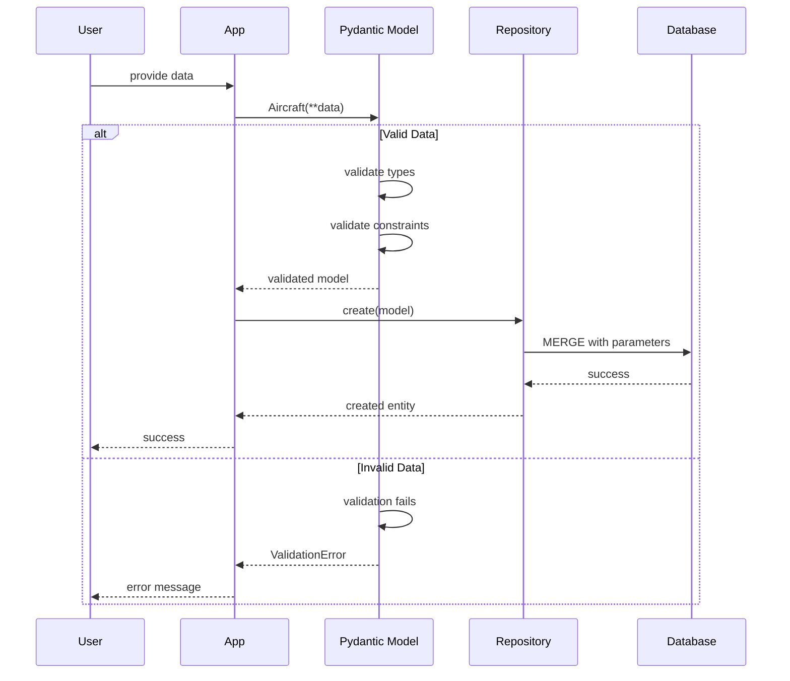
```mermaid
sequenceDiagram
    participant User
    participant App
    participant Model as Pydantic Model
    participant Repo as Repository
    participant DB as Database
    
    User->>App: provide data
    App->>Model: Aircraft(**data)
    
    alt Valid Data
        Model->>Model: validate types
        Model->>Model: validate constraints
        Model-->>App: validated model
        App->>Repo: create(model)
        Repo->>DB: MERGE with parameters
        DB-->>Repo: success
        Repo-->>App: created entity
        App-->>User: success
    else Invalid Data
        Model->>Model: validation fails
        Model-->>App: ValidationError
        App-->>User: error message
    end
```

## Testing Architecture

### Test Structure

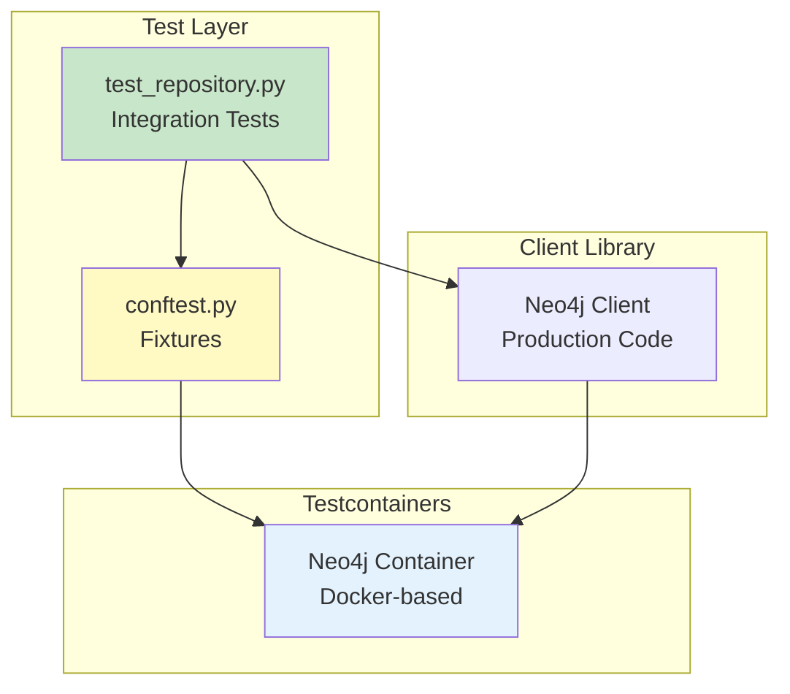
```mermaid
graph TB
    subgraph "Test Layer"
        CONF[conftest.py<br/>Fixtures]
        TEST[test_repository.py<br/>Integration Tests]
    end
    
    subgraph "Testcontainers"
        CONT[Neo4j Container<br/>Docker-based]
    end
    
    subgraph "Client Library"
        CLIENT[Neo4j Client<br/>Production Code]
    end
    
    CONF --> CONT
    TEST --> CONF
    TEST --> CLIENT
    CLIENT --> CONT
    
    style CONT fill:#e3f2fd
    style CONF fill:#fff9c4
    style TEST fill:#c8e6c9
```

### Test Execution Flow

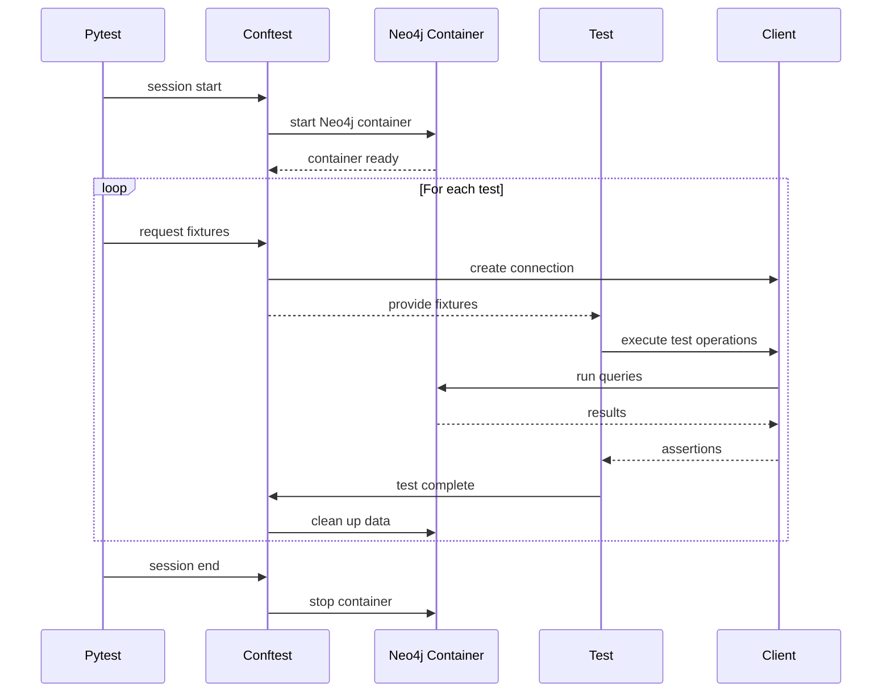
```mermaid
sequenceDiagram
    participant Pytest
    participant Conftest
    participant Container as Neo4j Container
    participant Test
    participant Client
    
    Pytest->>Conftest: session start
    Conftest->>Container: start Neo4j container
    Container-->>Conftest: container ready
    
    loop For each test
        Pytest->>Conftest: request fixtures
        Conftest->>Client: create connection
        Conftest-->>Test: provide fixtures
        
        Test->>Client: execute test operations
        Client->>Container: run queries
        Container-->>Client: results
        Client-->>Test: assertions
        
        Test->>Conftest: test complete
        Conftest->>Container: clean up data
    end
    
    Pytest->>Conftest: session end
    Conftest->>Container: stop container
```

## Error Handling

### Exception Hierarchy

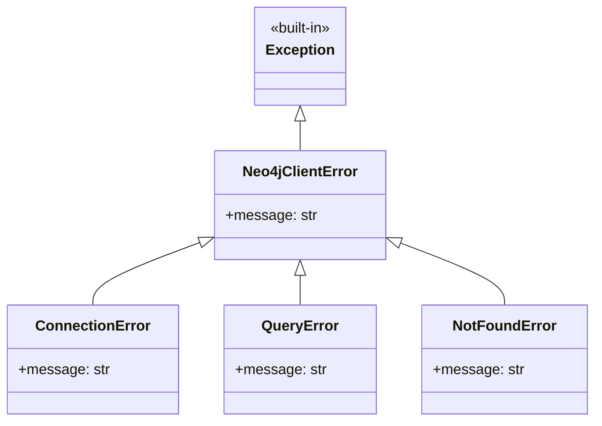
```mermaid
classDiagram
    class Exception {
        <<built-in>>
    }
    
    class Neo4jClientError {
        +message: str
    }
    
    class ConnectionError {
        +message: str
    }
    
    class QueryError {
        +message: str
    }
    
    class NotFoundError {
        +message: str
    }
    
    Exception <|-- Neo4jClientError
    Neo4jClientError <|-- ConnectionError
    Neo4jClientError <|-- QueryError
    Neo4jClientError <|-- NotFoundError
```

### Error Propagation

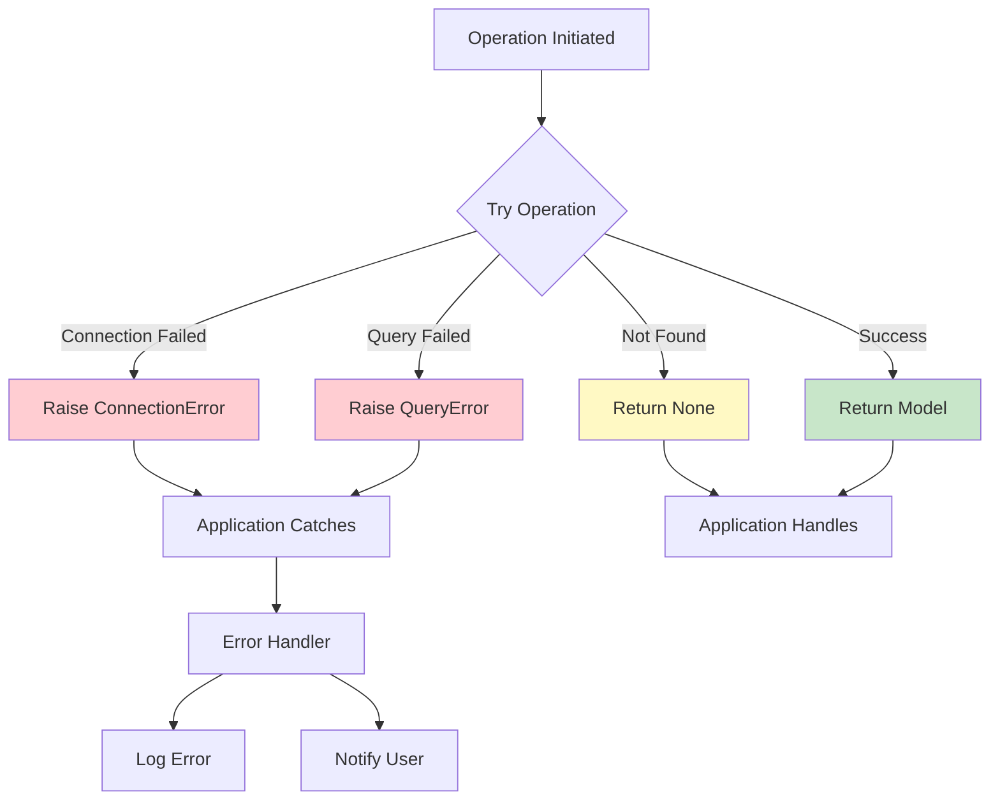
```mermaid
graph TB
    START[Operation Initiated] --> TRY{Try Operation}
    
    TRY -->|Connection Failed| CONN[Raise ConnectionError]
    TRY -->|Query Failed| QUERY[Raise QueryError]
    TRY -->|Not Found| RETURN[Return None]
    TRY -->|Success| SUCCESS[Return Model]
    
    CONN --> CATCH[Application Catches]
    QUERY --> CATCH
    RETURN --> APP[Application Handles]
    SUCCESS --> APP
    
    CATCH --> HANDLE[Error Handler]
    HANDLE --> LOG[Log Error]
    HANDLE --> NOTIFY[Notify User]
    
    style CONN fill:#ffcdd2
    style QUERY fill:#ffcdd2
    style RETURN fill:#fff9c4
    style SUCCESS fill:#c8e6c9
```

## Scalability Considerations

### Current Design (Simple)

The current design prioritizes simplicity:

- ✅ Synchronous operations only
- ✅ One session per operation
- ✅ No connection pooling abstractions
- ✅ No caching
- ✅ No batch operations

### Future Extensions

For production use, consider:

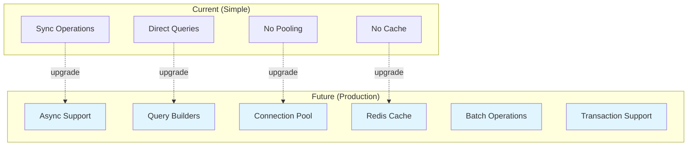
```mermaid
graph TB
    subgraph "Current (Simple)"
        C1[Sync Operations]
        C2[Direct Queries]
        C3[No Pooling]
        C4[No Cache]
    end
    
    subgraph "Future (Production)"
        F1[Async Support]
        F2[Query Builders]
        F3[Connection Pool]
        F4[Redis Cache]
        F5[Batch Operations]
        F6[Transaction Support]
    end
    
    C1 -.upgrade.-> F1
    C2 -.upgrade.-> F2
    C3 -.upgrade.-> F3
    C4 -.upgrade.-> F4
    
    style F1 fill:#e1f5ff
    style F2 fill:#e1f5ff
    style F3 fill:#e1f5ff
    style F4 fill:#e1f5ff
    style F5 fill:#e1f5ff
    style F6 fill:#e1f5ff
```

## Performance Patterns

### Query Optimization

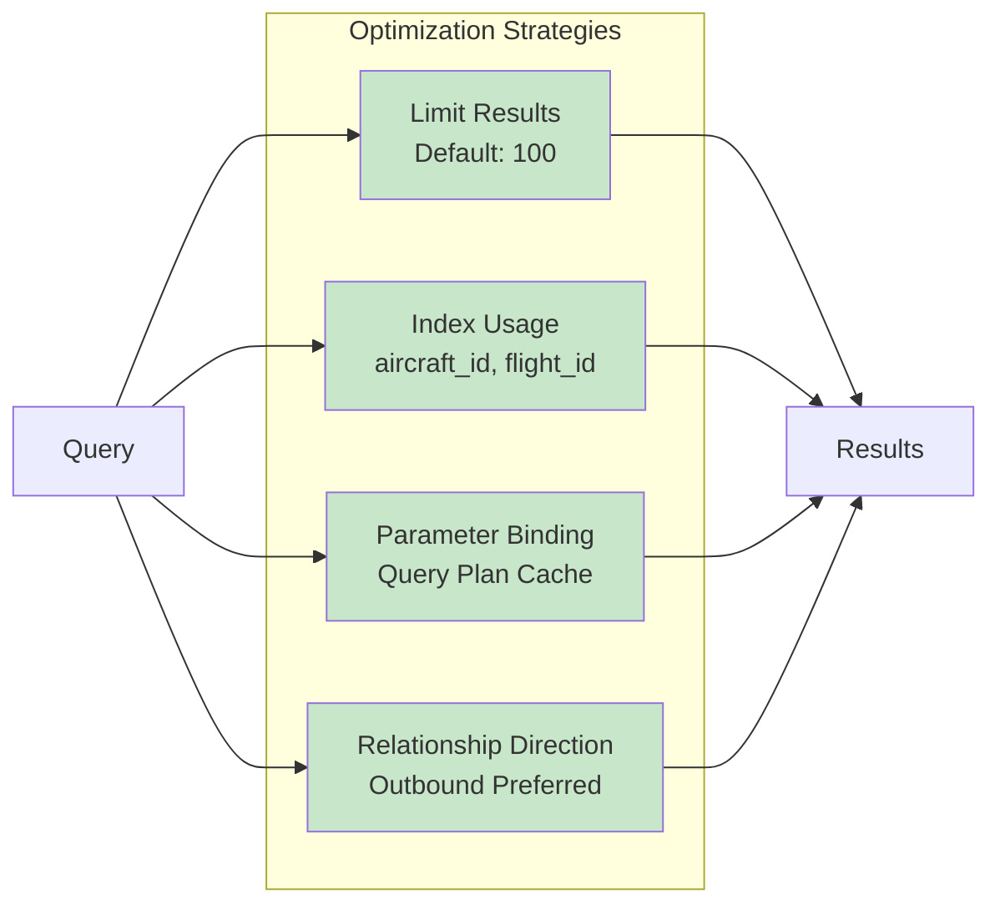
```mermaid
graph LR
    subgraph "Optimization Strategies"
        L1[Limit Results<br/>Default: 100]
        L2[Index Usage<br/>aircraft_id, flight_id]
        L3[Parameter Binding<br/>Query Plan Cache]
        L4[Relationship Direction<br/>Outbound Preferred]
    end
    
    Q[Query] --> L1
    Q --> L2
    Q --> L3
    Q --> L4
    
    L1 --> R[Results]
    L2 --> R
    L3 --> R
    L4 --> R
    
    style L1 fill:#c8e6c9
    style L2 fill:#c8e6c9
    style L3 fill:#c8e6c9
    style L4 fill:#c8e6c9
```

### Recommended Indexes

For optimal performance, create these indexes in Neo4j:

```cypher
-- Primary identifiers
CREATE INDEX aircraft_id FOR (a:Aircraft) ON (a.aircraft_id);
CREATE INDEX flight_id FOR (f:Flight) ON (f.flight_id);
CREATE INDEX system_id FOR (s:System) ON (s.system_id);

-- Frequently queried properties
CREATE INDEX aircraft_tail FOR (a:Aircraft) ON (a.tail_number);
CREATE INDEX airport_iata FOR (a:Airport) ON (a.iata);
CREATE INDEX event_severity FOR (m:MaintenanceEvent) ON (m.severity);
```

## Design Decisions

### Why Pydantic?

✅ **Type Safety** - Runtime validation of data  
✅ **IDE Support** - Better autocomplete and type checking  
✅ **Serialization** - Easy JSON conversion  
✅ **Documentation** - Field descriptions via docstrings  

### Why Repository Pattern?

✅ **Separation of Concerns** - Query logic isolated from business logic  
✅ **Testability** - Easy to mock repositories  
✅ **Consistency** - Uniform interface for data access  
✅ **Maintainability** - Changes to queries don't affect callers  

### Why Not ORM?

❌ **Graph Complexity** - ORMs work poorly with graph relationships  
❌ **Flexibility** - Direct Cypher gives more control  
❌ **Simplicity** - Repository pattern is simpler to understand  
❌ **Performance** - Direct queries are more efficient  

### Why Synchronous?

✅ **Simplicity** - Easier to understand and debug  
✅ **Sufficient** - Most applications don't need async  
✅ **Extensible** - Can add async later if needed  
✅ **Compatibility** - Works everywhere Python works  

## Summary

This architecture provides:

- **Simple, clean design** for easy understanding
- **Type-safe operations** with Pydantic models
- **Secure queries** with parameterization
- **Testable code** with dependency injection
- **Extensible foundation** for future enhancements

The design intentionally favors simplicity over features, providing a solid foundation that can be extended based on specific application needs.
