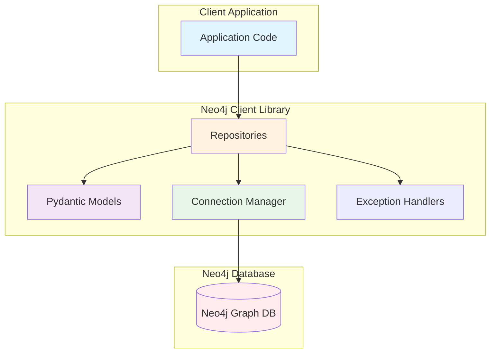
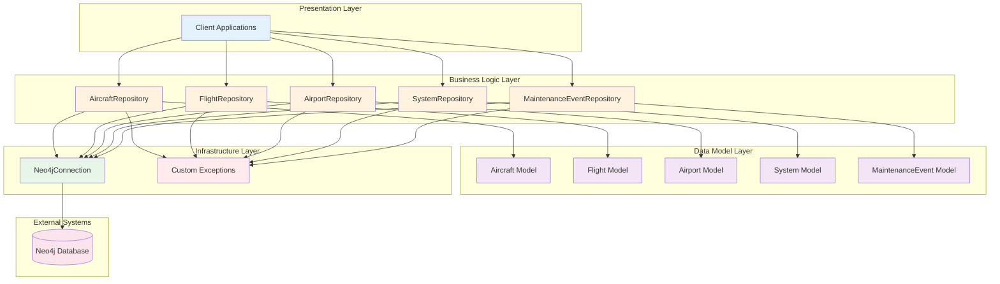
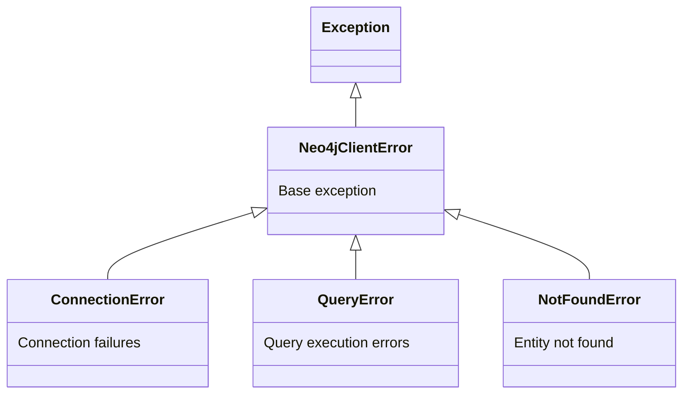
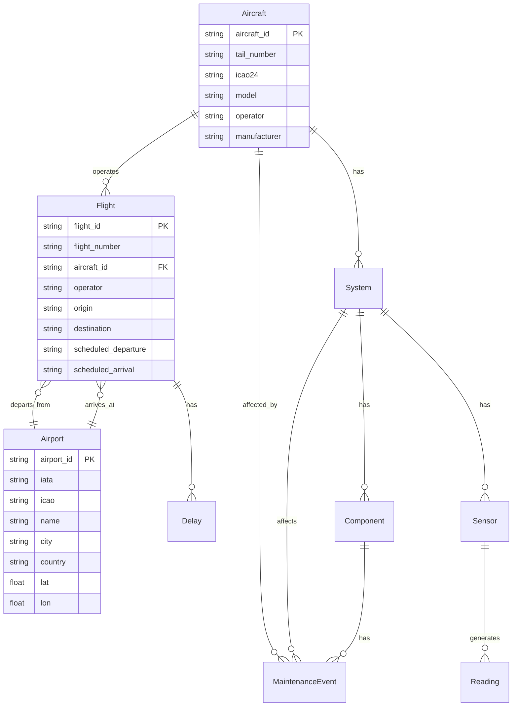
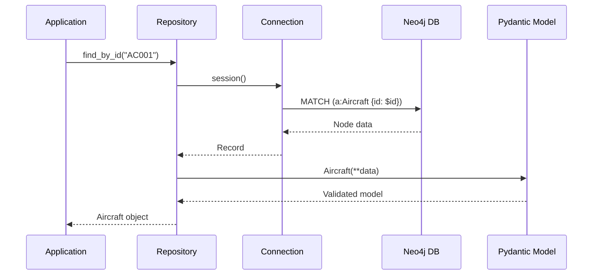
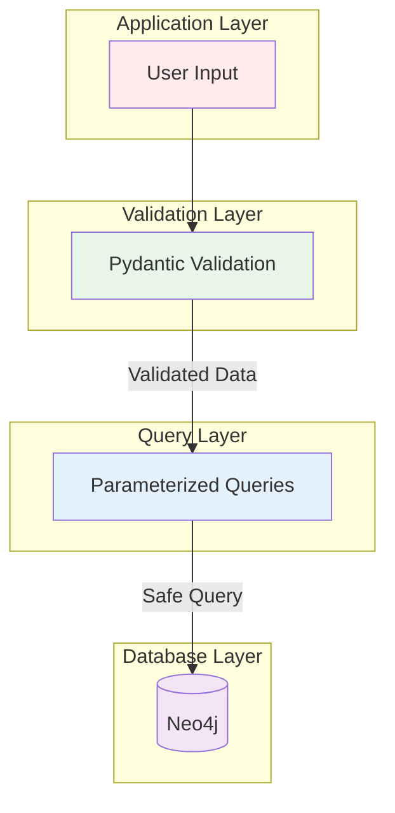
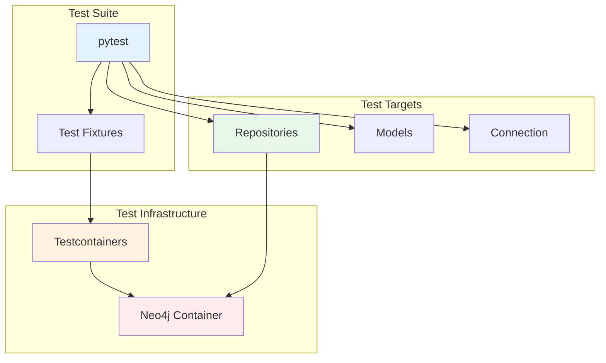
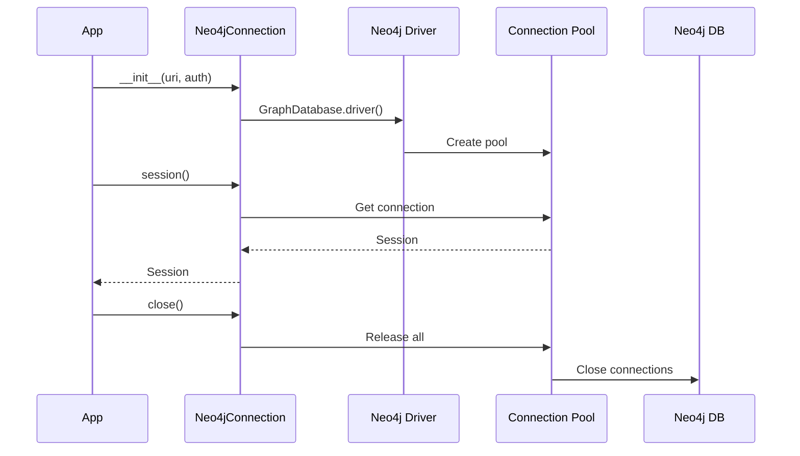

# Architecture Documentation

This document provides a detailed overview of the Neo4j Aircraft Data Python Client architecture, including design patterns, component interactions, and data flow.

## Table of Contents

- [System Overview](#system-overview)
- [Component Architecture](#component-architecture)
- [Data Models](#data-models)
- [Repository Pattern](#repository-pattern)
- [Query Patterns](#query-patterns)
- [Security Architecture](#security-architecture)
- [Testing Strategy](#testing-strategy)

## System Overview

The Neo4j Aircraft Data Python Client is designed as a lightweight, modular library that provides type-safe access to aircraft data stored in a Neo4j graph database.

### High-Level Architecture



### Design Principles

1. **Separation of Concerns** - Clear boundaries between data models, connection management, and query logic
2. **Type Safety** - Pydantic models provide runtime validation and IDE support
3. **Security First** - All queries use parameterization to prevent injection attacks
4. **Simplicity** - Focus on core functionality without over-engineering
5. **Extensibility** - Repository pattern makes it easy to add new operations

## Component Architecture

### Layer Diagram



### Component Descriptions

#### 1. Models (`models.py`)

Pydantic-based data models representing Neo4j entities:

- **Aircraft** - Fleet aircraft with identification and specifications
- **Airport** - Airports with location data
- **Flight** - Flight operations
- **System** - Aircraft systems
- **Component** - System components
- **Sensor** - Monitoring sensors
- **Reading** - Sensor readings
- **MaintenanceEvent** - Maintenance records
- **Delay** - Flight delays

**Responsibilities:**
- Data validation
- Type safety
- Serialization/deserialization
- Business logic constraints

#### 2. Connection (`connection.py`)

Connection management with context manager support:

**Responsibilities:**
- Neo4j driver initialization
- Connection pooling (via driver)
- Session management
- Resource cleanup

**Pattern:** Context Manager
```python
with Neo4jConnection(uri, user, password) as conn:
    # Use connection
    pass
# Automatic cleanup
```

#### 3. Repositories (`repository.py`)

Data access layer using repository pattern:

- **AircraftRepository** - Aircraft CRUD operations
- **FlightRepository** - Flight queries
- **AirportRepository** - Airport queries
- **SystemRepository** - System queries
- **MaintenanceEventRepository** - Maintenance event queries

**Responsibilities:**
- Encapsulate Cypher queries
- Transform database results to models
- Handle query errors
- Provide clean API

#### 4. Exceptions (`exceptions.py`)

Custom exception hierarchy:



## Data Models

### Entity Relationship Overview



### Pydantic Model Structure

All models follow this pattern:

```python
class Entity(BaseModel):
    """Entity description.
    
    Properties:
        field1: Description
        field2: Description
    """
    field1: str
    field2: Optional[int] = None
```

**Benefits:**
- Automatic validation
- JSON serialization
- Type hints for IDE support
- Self-documenting code

## Repository Pattern

### Architecture



### Query Flow

1. **Application** calls repository method
2. **Repository** constructs parameterized Cypher query
3. **Connection** provides database session
4. **Query** executes with parameters
5. **Results** are transformed to Pydantic models
6. **Models** validated and returned

### Example: Aircraft Repository

```python
class AircraftRepository:
    def find_by_id(self, aircraft_id: str) -> Optional[Aircraft]:
        query = """
        MATCH (a:Aircraft {aircraft_id: $aircraft_id})
        RETURN a
        """
        
        with self.connection.session() as session:
            result = session.run(query, aircraft_id=aircraft_id)
            record = result.single()
            
            if record:
                node = record["a"]
                return Aircraft(**node)
            return None
```

**Key Features:**
- Parameterized queries ($aircraft_id)
- Session management
- Error handling
- Model transformation
- Type hints

## Query Patterns

### Read Patterns

#### 1. Simple Node Lookup

```cypher
MATCH (a:Aircraft {aircraft_id: $aircraft_id})
RETURN a
```

#### 2. Relationship Traversal

```cypher
MATCH (a:Aircraft {aircraft_id: $aircraft_id})-[:OPERATES_FLIGHT]->(f:Flight)
RETURN f
ORDER BY f.scheduled_departure DESC
LIMIT $limit
```

#### 3. Multi-hop Traversal

```cypher
MATCH (a:Aircraft {aircraft_id: $aircraft_id})-[:HAS_SYSTEM]->(s:System)
OPTIONAL MATCH (s)-[:HAS_COMPONENT]->(c:Component)
RETURN s, collect(c) as components
```

### Write Patterns

#### 1. Create/Merge Node

```cypher
MERGE (a:Aircraft {aircraft_id: $aircraft_id})
SET a.tail_number = $tail_number,
    a.model = $model,
    a.operator = $operator
RETURN a
```

**Why MERGE?**
- Idempotent (safe to run multiple times)
- Prevents duplicate nodes
- Updates existing nodes

#### 2. Update Node

```cypher
MATCH (a:Aircraft {aircraft_id: $aircraft_id})
SET a.operator = $new_operator
RETURN a
```

#### 3. Delete Node

```cypher
MATCH (a:Aircraft {aircraft_id: $aircraft_id})
DELETE a
RETURN count(a) as deleted
```

## Security Architecture

### Defense in Depth



### Security Features

#### 1. Parameterized Queries

**✅ Secure:**
```python
query = "MATCH (a:Aircraft {aircraft_id: $aircraft_id}) RETURN a"
session.run(query, aircraft_id=user_input)
```

**❌ Insecure (Never do this):**
```python
query = f"MATCH (a:Aircraft {{aircraft_id: '{user_input}'}}) RETURN a"
session.run(query)
```

#### 2. Pydantic Validation

```python
aircraft = Aircraft(
    aircraft_id="AC001",  # Validated by Pydantic
    tail_number="N12345",
    # ... other fields
)
# InvalidInput raises ValidationError
```

#### 3. Exception Handling

```python
try:
    repo.find_by_id(aircraft_id)
except QueryError as e:
    # Handle query errors
except NotFoundError as e:
    # Handle not found
except ConnectionError as e:
    # Handle connection issues
```

## Testing Strategy

### Test Architecture



### Test Layers

#### 1. Integration Tests

Test real database operations with testcontainers:

```python
def test_create_aircraft(connection):
    repo = AircraftRepository(connection)
    aircraft = Aircraft(...)
    result = repo.create(aircraft)
    assert result.aircraft_id == aircraft.aircraft_id
```

#### 2. Fixture-Based Testing

Reusable fixtures for consistency:

```python
@pytest.fixture(scope="session")
def neo4j_container():
    with Neo4jContainer("neo4j:5.15") as container:
        yield container

@pytest.fixture
def connection(neo4j_container):
    conn = Neo4jConnection(...)
    yield conn
    # Cleanup
    conn.close()
```

#### 3. Test Coverage

Tests cover:
- CRUD operations
- Error handling
- Edge cases (not found, duplicates)
- Relationship traversals
- Data validation

## Performance Considerations

### Connection Management



### Query Optimization

1. **Use LIMIT** - Prevent unbounded result sets
2. **Index usage** - Ensure primary keys are indexed
3. **Parameterization** - Enable query caching
4. **Session reuse** - Within context managers

## Extension Points

### Adding New Repositories

1. Create repository class
2. Implement query methods
3. Use parameterized queries
4. Return Pydantic models
5. Handle exceptions

### Adding New Models

1. Create Pydantic model
2. Document properties
3. Add validation rules
4. Export in `__init__.py`

### Adding Complex Queries

1. Write parameterized Cypher
2. Test with real data
3. Document query pattern
4. Add to repository

## Summary

This architecture provides:

✅ **Clean separation** of concerns  
✅ **Type safety** with Pydantic  
✅ **Security** with parameterized queries  
✅ **Testability** with testcontainers  
✅ **Extensibility** through repository pattern  
✅ **Simplicity** without over-engineering  

The design focuses on providing a solid foundation that developers can extend for their specific needs while maintaining best practices for security, testing, and code quality.
