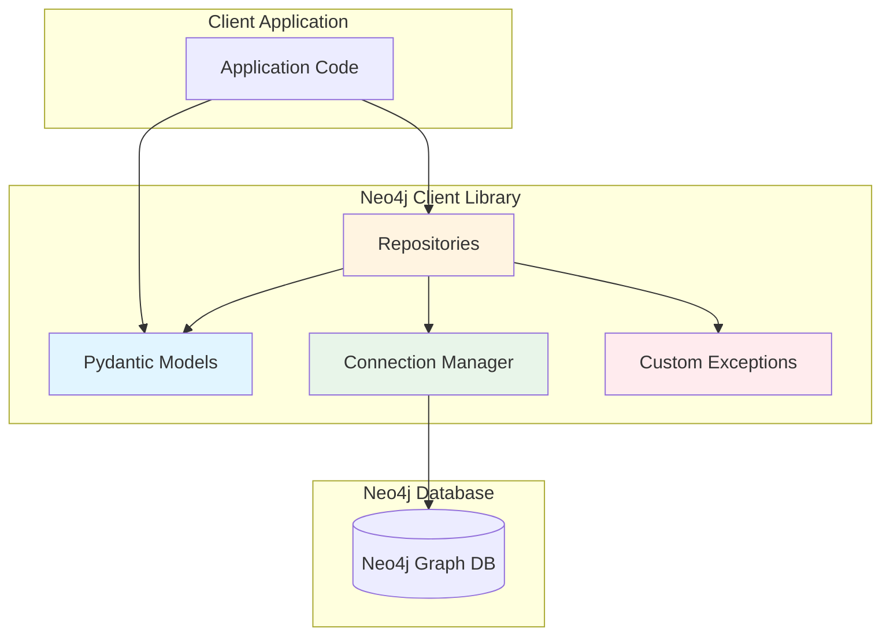
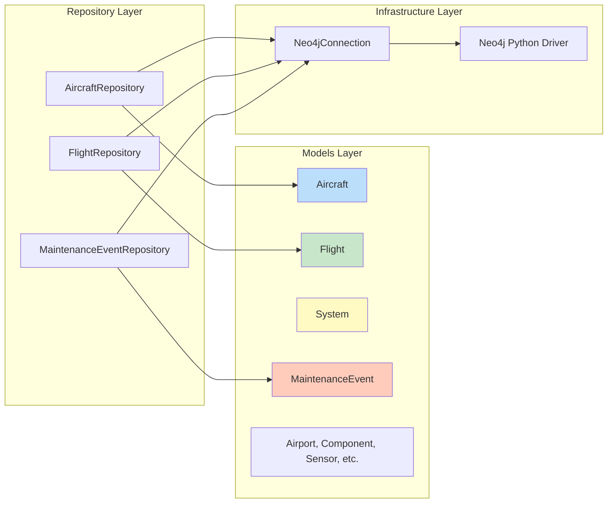
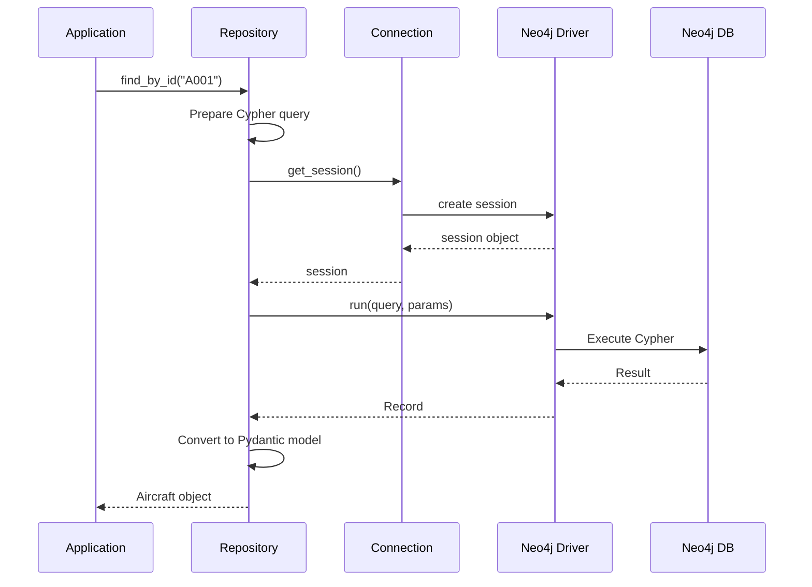
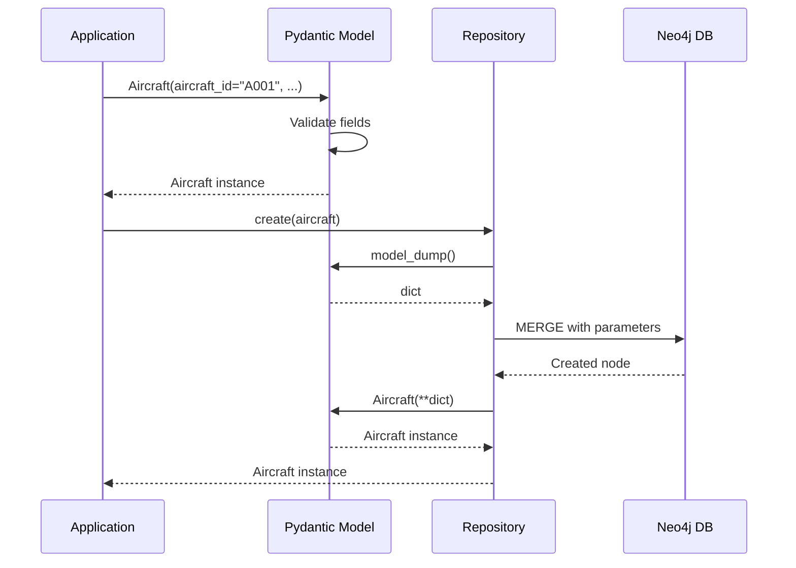

# Neo4j Aircraft Client Architecture

This document describes the architecture of the Python Neo4j client library for working with aircraft data.

## Table of Contents

- [Overview](#overview)
- [Architecture Diagram](#architecture-diagram)
- [Component Design](#component-design)
- [Data Flow](#data-flow)
- [Package Structure](#package-structure)
- [Design Patterns](#design-patterns)
- [Security Considerations](#security-considerations)

## Overview

The Neo4j Aircraft Client is a Python library that provides a type-safe, secure, and easy-to-use interface for working with aircraft data stored in a Neo4j graph database. It follows Python best practices and implements the Repository pattern for clean separation of concerns.

### Key Features

- **Type Safety**: Pydantic models for all entities with validation
- **Repository Pattern**: Clean query organization and reusability
- **Parameterized Queries**: All Cypher queries use parameters to prevent injection
- **Connection Management**: Context manager support for resource cleanup
- **Error Handling**: Custom exception hierarchy for clear error reporting
- **Testable**: Integration tests using testcontainers

## Architecture Diagram

### High-Level Architecture



### Component Architecture



## Component Design

### 1. Models (`models.py`)

Pydantic models provide type-safe data classes for all Neo4j entities.

**Entities:**
- `Aircraft` - Aircraft with tail number, model, operator
- `Airport` - Airport with IATA/ICAO codes, location
- `Flight` - Flight operations with schedules
- `System` - Aircraft systems (hydraulics, avionics, etc.)
- `Component` - System components
- `Sensor` - Monitoring sensors
- `Reading` - Time-series sensor readings
- `MaintenanceEvent` - Maintenance events and faults
- `Delay` - Flight delay incidents

**Benefits:**
- Runtime validation of data types
- Auto-completion in IDEs
- Clear API documentation
- JSON serialization/deserialization

### 2. Repositories (`repository.py`)

Repository classes implement the Repository pattern for database operations.

**Available Repositories:**
- `AircraftRepository` - CRUD + relationships (systems, flights, maintenance)
- `FlightRepository` - CRUD + delays
- `MaintenanceEventRepository` - CRUD + severity filtering

**Common Methods:**
- `create(entity)` - Create new entity (uses MERGE)
- `find_by_id(id)` - Find by primary identifier
- `find_all(limit)` - Get all entities with limit
- `update(entity)` - Update existing entity
- `delete(id)` - Delete entity

**Relationship Methods:**
- `get_systems(aircraft_id)` - Get aircraft systems
- `get_flights(aircraft_id)` - Get aircraft flights
- `get_maintenance_events(aircraft_id)` - Get aircraft maintenance
- `get_delays(flight_id)` - Get flight delays

### 3. Connection Management (`connection.py`)

The `Neo4jConnection` class manages database connectivity.

**Features:**
- Connection pooling via Neo4j driver
- Context manager support (`with` statement)
- Session management
- Connection verification

**Usage Pattern:**
```python
with Neo4jConnection(uri, username, password) as conn:
    repo = AircraftRepository(conn)
    aircraft = repo.find_by_id("A001")
```

### 4. Exception Handling (`exceptions.py`)

Custom exception hierarchy for clear error reporting.

```
Neo4jClientError (base)
├── ConnectionError - Connection failures
├── QueryError - Query execution errors
└── NotFoundError - Entity not found errors
```

## Data Flow

### Query Execution Flow



### Create Entity Flow



## Package Structure

```
neo4j_client/
├── __init__.py          # Package exports
├── models.py            # Pydantic data classes (9 models)
├── repository.py        # Repository pattern (3 repositories)
├── connection.py        # Connection management
└── exceptions.py        # Custom exception classes

tests/
├── __init__.py
├── conftest.py          # pytest fixtures with testcontainers
└── test_repository.py   # Integration tests

pyproject.toml           # Modern Python packaging
README.md                # Usage documentation
ARCHITECTURE.md          # This file
```

## Design Patterns

### Repository Pattern

The Repository pattern provides an abstraction layer between the business logic and data access.

**Benefits:**
- Centralized query logic
- Easy to test (mock repositories)
- Consistent API across entities
- Reusable queries

**Example:**
```python
class AircraftRepository:
    def find_by_id(self, aircraft_id: str) -> Optional[Aircraft]:
        query = "MATCH (a:Aircraft {aircraft_id: $aircraft_id}) RETURN a"
        # Execute query, return model
```

### Context Manager Pattern

The Connection class implements the context manager protocol for automatic resource cleanup.

**Benefits:**
- Automatic connection closing
- Exception-safe cleanup
- Pythonic resource management

**Example:**
```python
with Neo4jConnection(uri, username, password) as conn:
    # Connection is automatically opened and closed
    repo = AircraftRepository(conn)
    aircraft = repo.find_all()
```

### Factory Pattern

Pydantic models act as factories for validated entity instances.

**Benefits:**
- Validation at construction time
- Type coercion
- Clear error messages

## Security Considerations

### Parameterized Queries

**All Cypher queries use named parameters** to prevent injection attacks.

❌ **NEVER do this:**
```python
query = f"MATCH (a:Aircraft {{aircraft_id: '{aircraft_id}'}}) RETURN a"
```

✅ **ALWAYS do this:**
```python
query = "MATCH (a:Aircraft {aircraft_id: $aircraft_id}) RETURN a"
session.run(query, aircraft_id=aircraft_id)
```

### MERGE vs CREATE

The library uses `MERGE` instead of `CREATE` to avoid duplicate nodes.

```cypher
MERGE (a:Aircraft {aircraft_id: $aircraft_id})
SET a.tail_number = $tail_number, ...
```

### Input Validation

Pydantic models validate all inputs before executing queries.

```python
aircraft = Aircraft(
    aircraft_id="A001",
    tail_number="N12345",
    # ... Pydantic validates types and required fields
)
```

### Error Handling

Custom exceptions wrap Neo4j driver exceptions for security.

```python
try:
    aircraft = repo.find_by_id("A001")
except QueryError as e:
    # Generic error, doesn't expose internals
    logger.error(f"Query failed: {e}")
```

## Extension Points

### Adding New Repositories

To add a new repository:

1. Create entity model in `models.py`
2. Create repository class in `repository.py`
3. Export from `__init__.py`
4. Add tests in `tests/test_repository.py`

**Example:**
```python
class AirportRepository:
    def __init__(self, connection: Neo4jConnection):
        self.connection = connection
    
    def find_by_iata(self, iata: str) -> Optional[Airport]:
        query = "MATCH (a:Airport {iata: $iata}) RETURN a"
        # Implementation...
```

### Adding Custom Queries

Add specialized query methods to existing repositories:

```python
class AircraftRepository:
    def find_by_operator(self, operator: str) -> List[Aircraft]:
        query = """
        MATCH (a:Aircraft {operator: $operator})
        RETURN a
        ORDER BY a.tail_number
        """
        # Implementation...
```

## Performance Considerations

### Query Limits

All `find_all()` methods include default limits to prevent accidentally loading large datasets.

```python
def find_all(self, limit: int = 100) -> List[Aircraft]:
    query = "MATCH (a:Aircraft) RETURN a LIMIT $limit"
```

### Connection Pooling

The Neo4j Python driver automatically manages a connection pool for efficiency.

### Recommended Indexes

For optimal performance, create these indexes:

```cypher
CREATE INDEX aircraft_id FOR (a:Aircraft) ON (a.aircraft_id);
CREATE INDEX flight_id FOR (f:Flight) ON (f.flight_id);
CREATE INDEX event_severity FOR (m:MaintenanceEvent) ON (m.severity);
```

## Testing Strategy

### Integration Tests with Testcontainers

Tests use real Neo4j containers for accurate integration testing.

**Benefits:**
- Tests against real Neo4j instance
- Isolated test environment
- Automatic cleanup
- CI/CD compatible

### Test Structure

```python
@pytest.fixture(scope="session")
def neo4j_container():
    container = Neo4jContainer("neo4j:5.14")
    container.start()
    yield container
    container.stop()

def test_create_aircraft(aircraft_repo, sample_aircraft):
    created = aircraft_repo.create(sample_aircraft)
    assert created.aircraft_id == sample_aircraft.aircraft_id
```

## Future Enhancements

### Potential Additions

- **Async support** - Add async/await with `asyncio`
- **Batch operations** - Bulk create/update methods
- **Transaction support** - Explicit transaction management
- **Query builder** - Fluent API for building queries
- **Caching layer** - Optional caching for read operations
- **Relationship repositories** - Dedicated repos for relationships
- **Event sourcing** - Track entity changes over time

### Current Limitations

- **Synchronous only** - No async/await support
- **Basic transactions** - Implicit transactions only
- **No caching** - All queries hit database
- **Limited relationships** - Some relationship types not exposed
- **No pagination** - Simple limit-based queries only

## Summary

The Neo4j Aircraft Client provides a **clean, type-safe, and secure foundation** for working with aircraft data in Neo4j. It follows Python best practices, implements proven design patterns, and prioritizes security through parameterized queries and input validation.

The architecture is **extensible and maintainable**, making it easy to add new repositories, queries, and features as requirements evolve.
