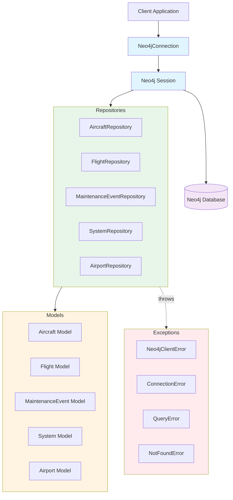
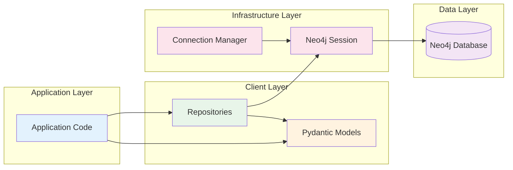
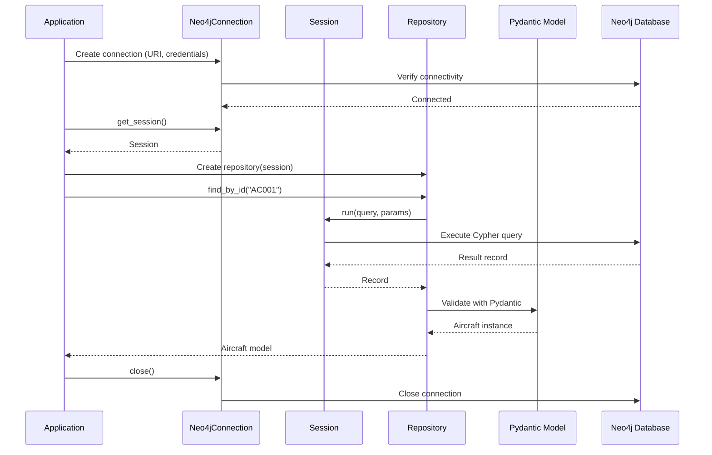
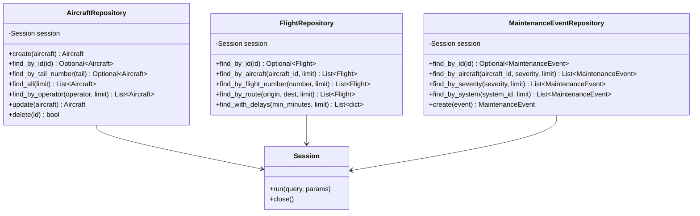
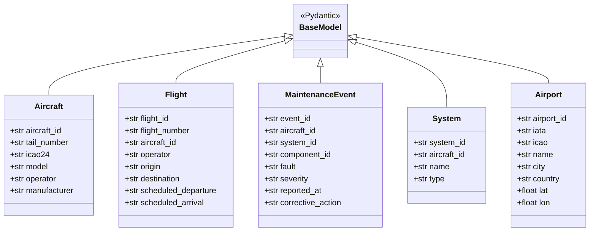
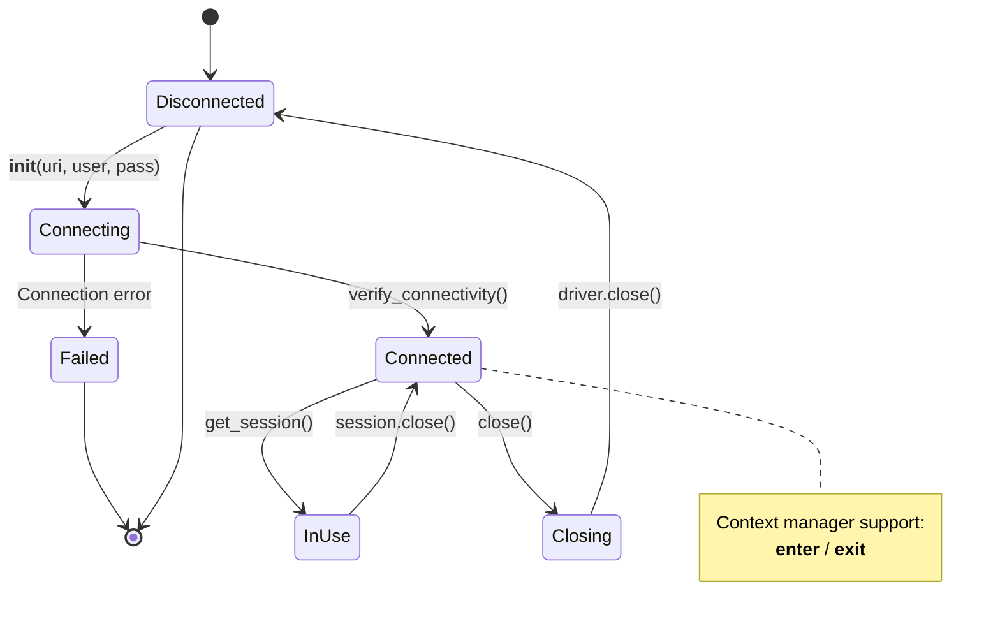
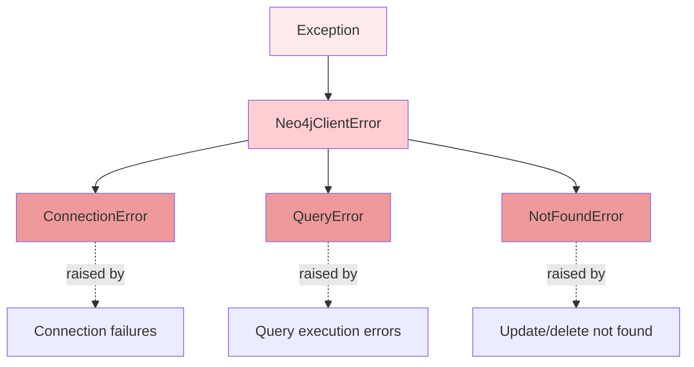
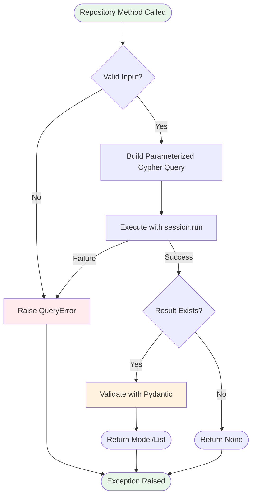
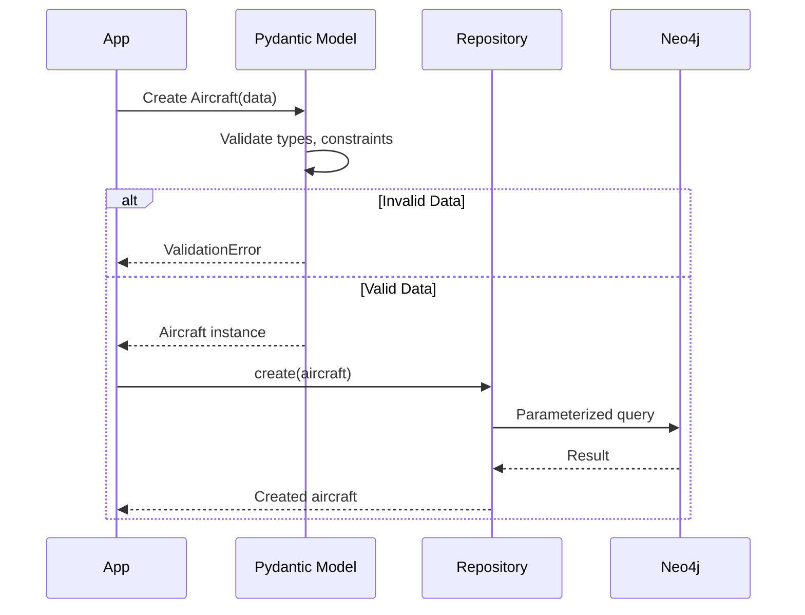
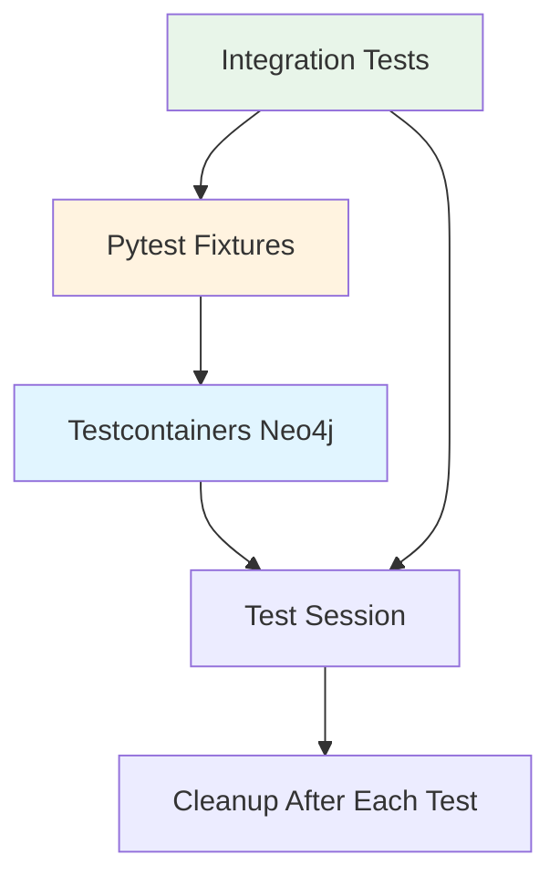

# Architecture Documentation

This document describes the architecture of the Neo4j Aircraft Client library.

## Overview

The Neo4j Aircraft Client is a Python library that provides a clean, type-safe interface for working with aviation data stored in Neo4j. It follows established design patterns and Python best practices.

## Architecture Principles

1. **Separation of Concerns** - Clear boundaries between connection, data models, and data access
2. **Type Safety** - Pydantic models ensure data validation and type checking
3. **Dependency Injection** - Repositories accept sessions, not connections
4. **Parameterized Queries** - All Cypher queries use parameters to prevent injection
5. **Resource Management** - Context managers ensure proper cleanup

## Component Architecture



## Layer Architecture



## Data Flow



## Repository Pattern

The library uses the Repository Pattern to encapsulate data access logic:



## Model Hierarchy



## Connection Management



## Error Handling



## Query Execution Pattern

All repository methods follow this pattern:



## Security Considerations

### Parameterized Queries

All Cypher queries use parameters to prevent injection attacks:

```python
# ✅ GOOD - Parameterized query
query = "MATCH (a:Aircraft {aircraft_id: $aircraft_id}) RETURN a"
result = session.run(query, aircraft_id=user_input)

# ❌ BAD - String interpolation (vulnerable to injection)
query = f"MATCH (a:Aircraft {{aircraft_id: '{user_input}'}}) RETURN a"
result = session.run(query)
```

### Input Validation

Pydantic models validate all input data before it reaches the database:



## Package Structure

```
neo4j_client/
├── __init__.py          # Package exports and public API
├── connection.py        # Connection management (Neo4jConnection)
├── models.py            # Pydantic data models
├── repository.py        # Repository classes for data access
└── exceptions.py        # Custom exception hierarchy

tests/
├── __init__.py
├── conftest.py          # Pytest fixtures (testcontainers)
└── test_repository.py   # Integration tests

pyproject.toml           # Modern Python packaging (PEP 621)
README_CLIENT.md         # User documentation
ARCHITECTURE.md          # This file
```

## Design Patterns Used

### 1. Repository Pattern
Encapsulates data access logic and provides a clean API for queries.

### 2. Dependency Injection
Repositories accept sessions as constructor parameters, allowing for flexible testing and connection management.

### 3. Context Manager
`Neo4jConnection` implements `__enter__` and `__exit__` for safe resource cleanup:

```python
with Neo4jConnection(uri, user, pass) as conn:
    session = conn.get_session()
    # ... use session
    # Automatic cleanup on exit
```

### 4. Factory Pattern
Repositories create Pydantic model instances from database records.

### 5. Data Transfer Object (DTO)
Pydantic models serve as DTOs, transferring data between layers with validation.

## Testing Strategy



The test suite uses:
- **Testcontainers** - Spins up real Neo4j instance in Docker
- **Pytest fixtures** - Manages container lifecycle
- **Session-scoped fixtures** - Reuses container across tests
- **Cleanup** - Deletes all data after each test

## Extension Points

The library is designed to be extended:

### 1. Add New Repositories
```python
class SensorRepository:
    def __init__(self, session: Session):
        self.session = session
    
    def find_by_system(self, system_id: str) -> List[Sensor]:
        # Implementation
        pass
```

### 2. Add Custom Query Methods
```python
class AircraftRepository:
    # ... existing methods ...
    
    def find_by_manufacturer_and_operator(
        self,
        manufacturer: str,
        operator: str
    ) -> List[Aircraft]:
        query = """
        MATCH (a:Aircraft {manufacturer: $manufacturer, operator: $operator})
        RETURN a
        """
        result = self.session.run(query, manufacturer=manufacturer, operator=operator)
        return [Aircraft(**record["a"]) for record in result]
```

### 3. Add Computed Properties to Models
```python
class Flight(BaseModel):
    # ... existing fields ...
    
    @property
    def route(self) -> str:
        return f"{self.origin}-{self.destination}"
```

### 4. Add Batch Operations
```python
class AircraftRepository:
    def create_batch(self, aircraft_list: List[Aircraft]) -> List[Aircraft]:
        # Batch insert implementation
        pass
```

## Performance Considerations

### Connection Pooling
The Neo4j driver manages connection pooling automatically. Reuse the same `Neo4jConnection` instance across requests.

### Session Management
Create sessions per transaction or logical unit of work, not per query.

### Query Optimization
- Use indexes for frequently queried properties
- Limit result sets with the `limit` parameter
- Consider pagination for large result sets

### Future Optimizations
- Implement result caching for read-heavy workloads
- Add batch operations for bulk inserts
- Consider async support for concurrent operations

## Summary

The Neo4j Aircraft Client provides:

✅ Clean separation of concerns with clear layers  
✅ Type-safe models with Pydantic validation  
✅ Secure parameterized queries  
✅ Repository pattern for organized data access  
✅ Comprehensive error handling  
✅ Context manager support for resource management  
✅ Integration tests with testcontainers  
✅ Extensible design for custom requirements  

This architecture balances simplicity with best practices, providing a solid foundation for working with aircraft data in Neo4j.
