# Architecture Documentation

This document describes the architecture of the Neo4j Aircraft Client library, including package structure, data flow, and design patterns.

## Table of Contents

- [Overview](#overview)
- [Package Structure](#package-structure)
- [Design Patterns](#design-patterns)
- [Data Flow](#data-flow)
- [Component Diagrams](#component-diagrams)
- [Security Architecture](#security-architecture)
- [Extension Points](#extension-points)

## Overview

The Neo4j Aircraft Client is designed as a lightweight, type-safe Python library for working with aviation data stored in Neo4j. It follows modern Python best practices and provides a clean, extensible foundation for building aircraft data applications.

### Design Principles

1. **Simplicity First** - Easy to understand and use
2. **Type Safety** - Pydantic models with full type hints
3. **Security by Default** - Parameterized queries, no string interpolation
4. **Separation of Concerns** - Clear boundaries between layers
5. **Extensibility** - Easy to add new entities and operations

## Package Structure

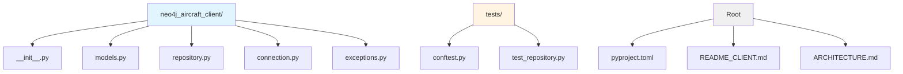

### Module Responsibilities

| Module | Purpose | Key Components |
|--------|---------|----------------|
| `models.py` | Data models and validation | Aircraft, Flight, Airport, System, MaintenanceEvent, Delay (Pydantic models) |
| `repository.py` | Data access layer | AircraftRepository, FlightRepository, AirportRepository, SystemRepository, MaintenanceEventRepository |
| `connection.py` | Database connectivity | Neo4jConnection (context manager) |
| `exceptions.py` | Error handling | Neo4jClientError, ConnectionError, QueryError, NotFoundError |
| `__init__.py` | Public API exports | Package interface and version |

## Design Patterns

### Repository Pattern

The library uses the Repository Pattern to abstract data access logic and provide a clean interface for CRUD operations.

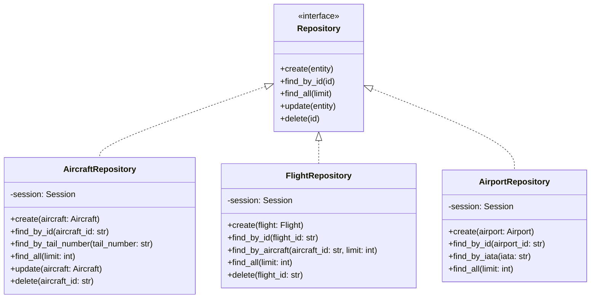

**Benefits:**

- Centralized data access logic
- Easy to test (can mock repositories)
- Clean separation from business logic
- Consistent API across entities

### Pydantic Models

All entities are defined as Pydantic models for automatic validation and type safety.

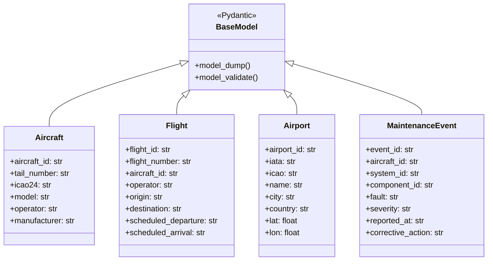

**Benefits:**

- Automatic data validation
- Type hints for IDE support
- Easy serialization/deserialization
- Self-documenting code

## Data Flow

### Read Operation Flow

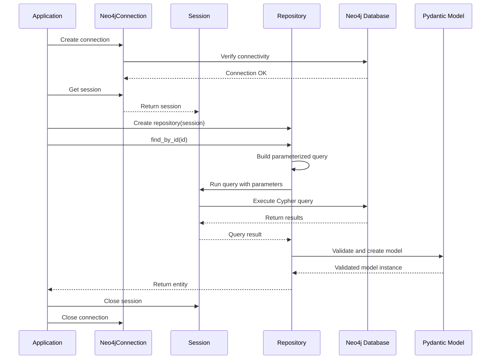

### Write Operation Flow

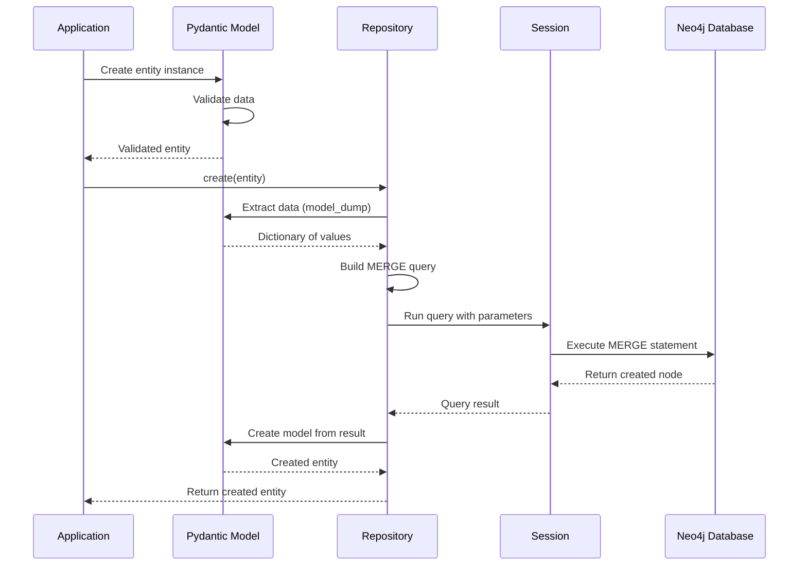

## Component Diagrams

### System Context

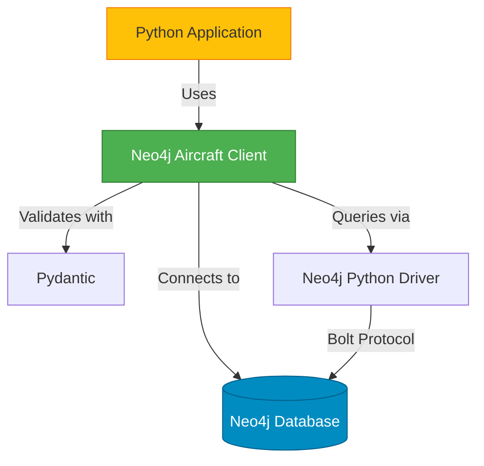

### Layer Architecture

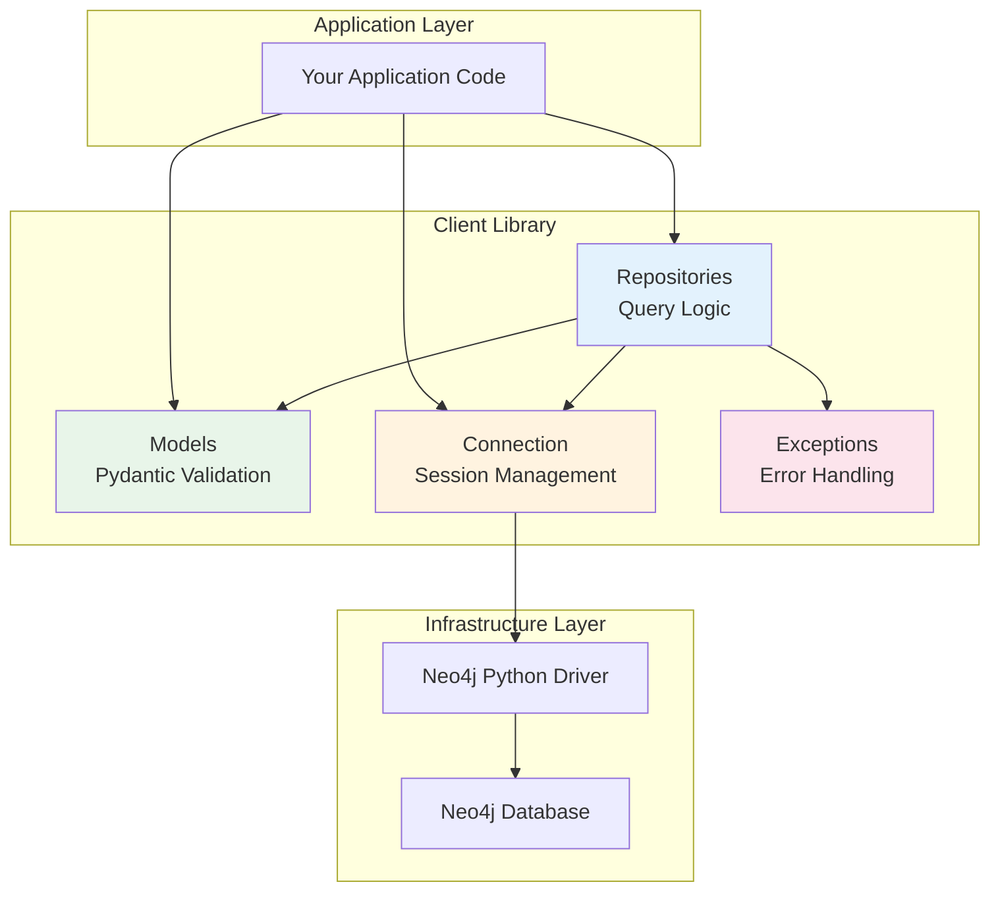

### Dependency Graph

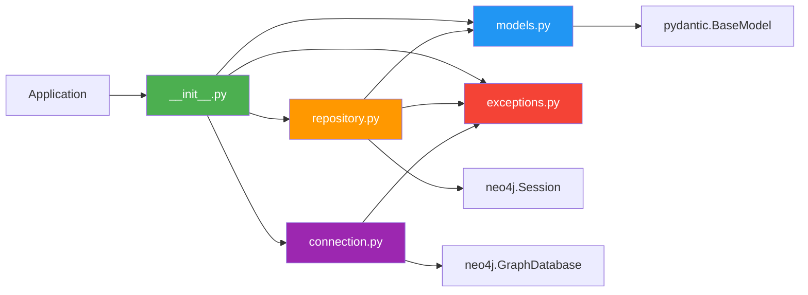

## Security Architecture

### Query Parameterization

All queries use Neo4j's parameterized query system to prevent Cypher injection attacks.

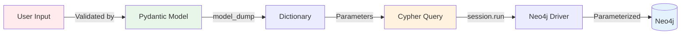

**Example:**

```python
# ❌ BAD - String interpolation (vulnerable to injection)
query = f"MATCH (a:Aircraft {{tail_number: '{tail_number}'}}) RETURN a"

# ✅ GOOD - Parameterized query (secure)
query = "MATCH (a:Aircraft {tail_number: $tail_number}) RETURN a"
result = session.run(query, tail_number=tail_number)
```

### Error Handling Flow

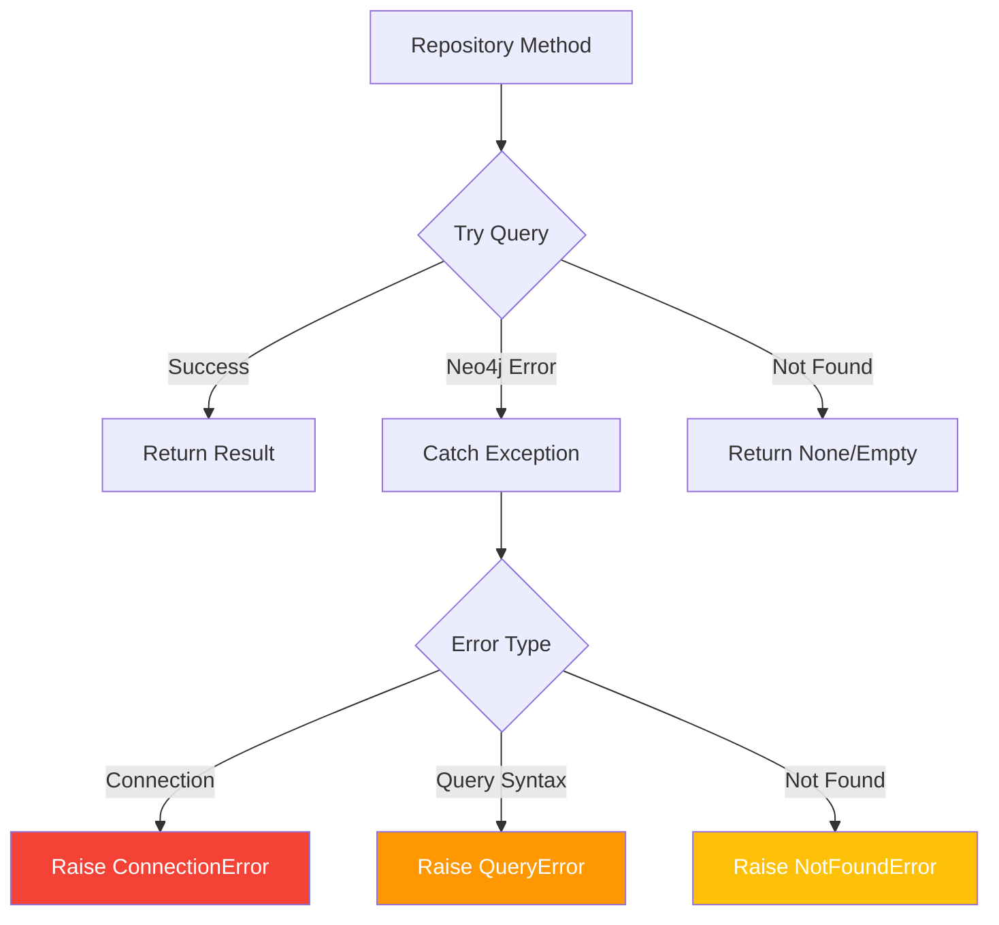

## Extension Points

### Adding New Entities

To add a new entity type:

1. **Define Model** in `models.py`:
```python
class NewEntity(BaseModel):
    entity_id: str
    name: str
    # ... other fields
```

2. **Create Repository** in `repository.py`:
```python
class NewEntityRepository:
    def __init__(self, session: Session):
        self.session = session
    
    def create(self, entity: NewEntity) -> NewEntity:
        # Implementation
    
    # ... other methods
```

3. **Export** in `__init__.py`:
```python
from .models import NewEntity
from .repository import NewEntityRepository

__all__ = [..., "NewEntity", "NewEntityRepository"]
```

### Adding Custom Queries

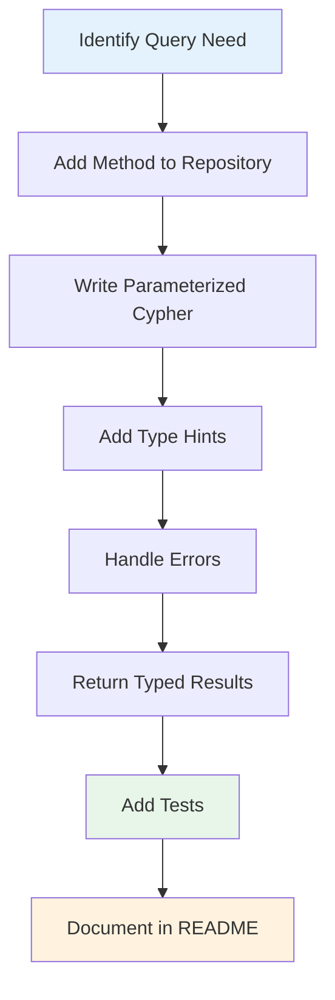

### Repository Extension Pattern

```python
class ExtendedAircraftRepository(AircraftRepository):
    """Extended repository with custom queries."""
    
    def find_by_operator(self, operator: str, limit: int = 100) -> List[Aircraft]:
        """Find aircraft by operator."""
        query = """
        MATCH (a:Aircraft {operator: $operator})
        RETURN a
        ORDER BY a.tail_number
        LIMIT $limit
        """
        result = self.session.run(query, operator=operator, limit=limit)
        return [Aircraft(**dict(record["a"])) for record in result]
```

## Testing Architecture

### Test Structure

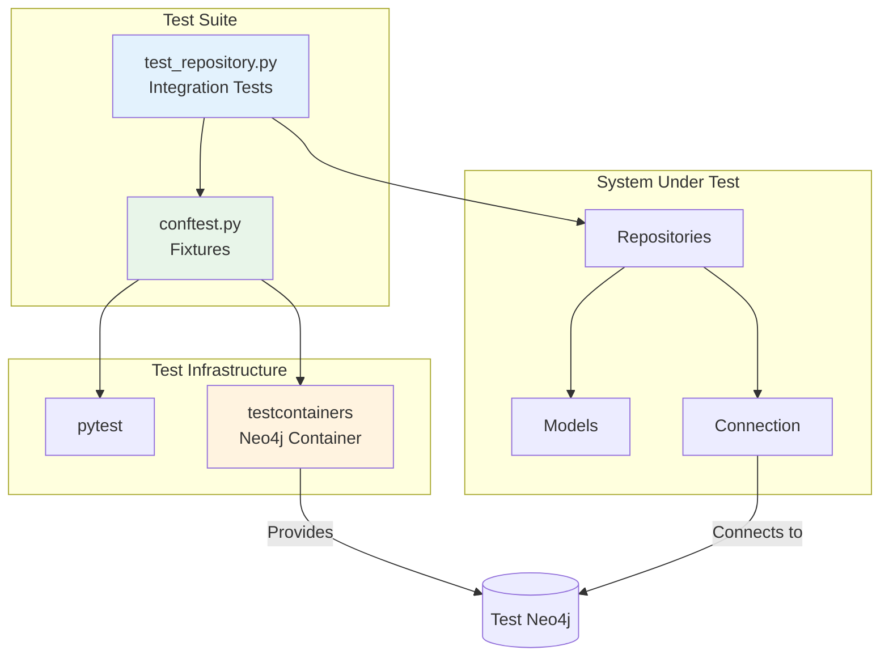

### Test Data Flow

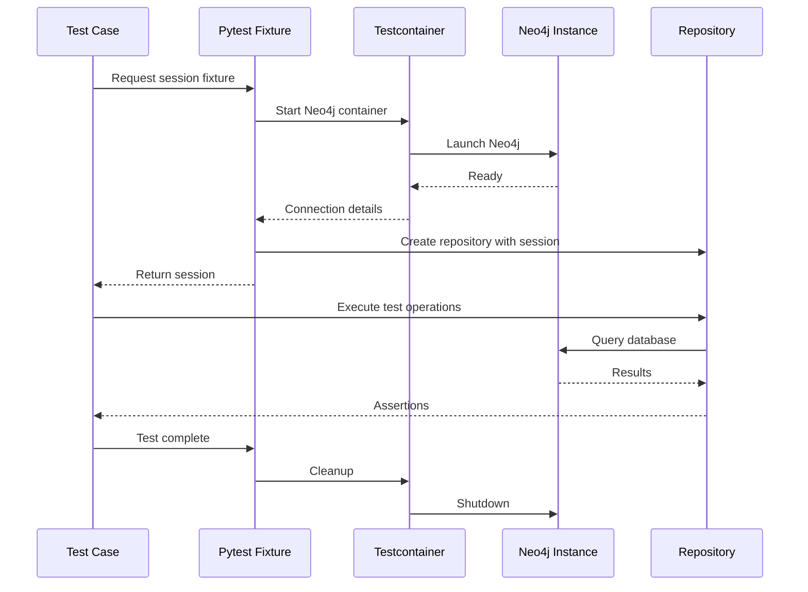

## Performance Considerations

### Connection Pooling

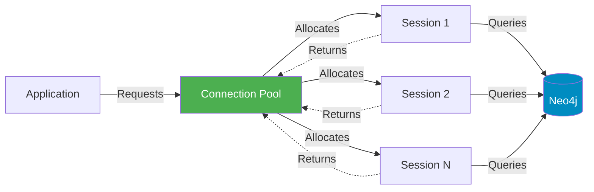

**Note:** The current implementation uses single connections. For production, consider implementing connection pooling.

### Query Optimization

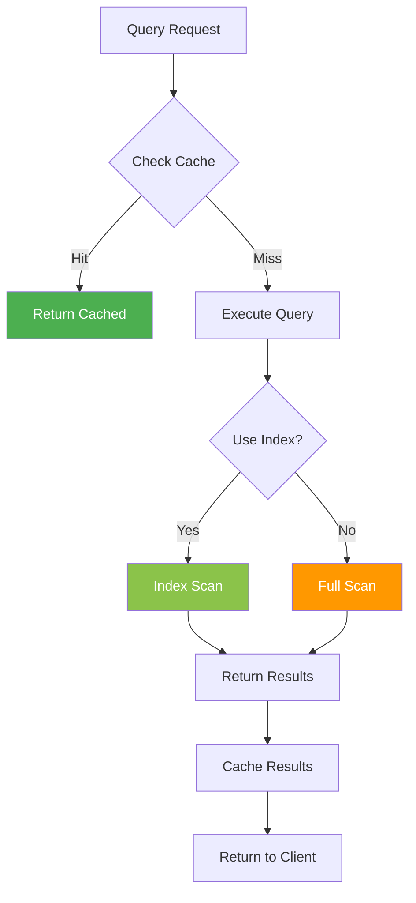

**Recommendations:**

1. Create indexes on frequently queried properties
2. Limit result sets with `LIMIT` clauses
3. Use relationship traversal instead of property matching when possible
4. Consider caching for frequently accessed data

## Summary

The Neo4j Aircraft Client architecture is designed to be:

- **Modular** - Clear separation of concerns
- **Extensible** - Easy to add new entities and queries
- **Secure** - Parameterized queries by default
- **Type-Safe** - Full Pydantic validation
- **Testable** - Repository pattern enables easy testing
- **Simple** - Minimal abstractions, clear code

This architecture provides a solid foundation for building aircraft data applications while remaining flexible enough to accommodate future requirements.
