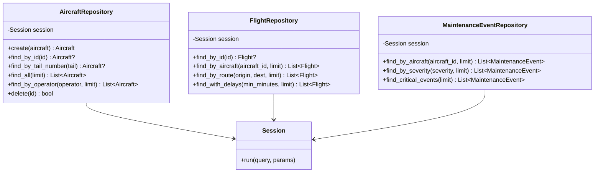

# Architecture Documentation

This document describes the architecture of the Neo4j Aircraft Data Client library.

## Overview

The library follows a layered architecture with clear separation of concerns:


## Component Layers

### 1. Models Layer (`models.py`)

**Purpose**: Define data structures with type safety and validation

**Components**:
- Pydantic `BaseModel` classes for each entity type
- Type hints for all fields
- Field descriptions and validation rules

**Key Classes**:
- `Aircraft` - Fleet aircraft data
- `Airport` - Airport information
- `Flight` - Flight operations
- `System` - Aircraft systems
- `Component` - System components
- `Sensor` - Monitoring sensors
- `Reading` - Time-series data
- `MaintenanceEvent` - Maintenance records
- `Delay` - Delay incidents

**Benefits**:
- ✅ Runtime type checking
- ✅ Automatic data validation
- ✅ Clear API contracts
- ✅ IDE autocomplete support

### 2. Connection Layer (`connection.py`)

**Purpose**: Manage database connections and sessions

**Components**:
- `Neo4jConnection` class with context manager support
- Connection pooling via Neo4j driver
- Session lifecycle management

**Key Features**:
- Connection URI configuration
- Authentication handling
- Database selection
- Automatic cleanup with context managers

**Usage Pattern**:
```python
with Neo4jConnection(uri, user, password) as conn:
    session = conn.get_session()
    # Use session
    session.close()
```

### 3. Repository Layer (`repository.py`)

**Purpose**: Encapsulate data access logic using repository pattern

**Components**:
- `AircraftRepository` - Aircraft CRUD operations
- `FlightRepository` - Flight queries
- `SystemRepository` - System queries
- `MaintenanceEventRepository` - Maintenance queries
- `AirportRepository` - Airport queries

**Key Responsibilities**:
- Execute parameterized Cypher queries
- Transform Neo4j records to Pydantic models
- Handle query errors gracefully
- Provide domain-specific query methods

**Benefits**:
- ✅ Centralized query logic
- ✅ Easy to test and mock
- ✅ Consistent error handling
- ✅ Single responsibility principle

### 4. Exception Layer (`exceptions.py`)

**Purpose**: Provide meaningful error types for different failure scenarios

**Components**:
- `Neo4jClientError` - Base exception class
- `ConnectionError` - Connection failures
- `QueryError` - Query execution failures
- `NotFoundError` - Entity not found errors

## Data Flow

### Read Operation Flow


### Write Operation Flow


## Repository Pattern Design

Each repository follows consistent patterns:



## Security Architecture

The library implements multiple security layers:


**Security Features**:

1. **Input Validation** - Pydantic models validate all data types and constraints
2. **Parameterized Queries** - All Cypher queries use named parameters
3. **No String Interpolation** - Never construct queries from user input
4. **Type Safety** - Strong typing prevents data corruption
5. **Exception Handling** - Errors are caught and wrapped in custom exceptions

## Connection Management


## Testing Architecture

The testing strategy uses testcontainers for true integration testing:


**Test Fixtures**:
- `neo4j_container` - Session-scoped Neo4j container
- `neo4j_connection` - Session-scoped connection
- `session` - Function-scoped clean session
- `*_repo` - Function-scoped repository instances

**Test Coverage**:
- ✅ CRUD operations
- ✅ Query filtering and pagination
- ✅ Relationship traversal
- ✅ Error conditions (not found, etc.)
- ✅ Data validation

## Package Structure

```
neo4j_client/
├── __init__.py          # Public API exports
├── models.py            # Pydantic data models
├── repository.py        # Repository pattern implementations
├── connection.py        # Connection management
└── exceptions.py        # Custom exception classes

tests/
├── __init__.py
├── conftest.py          # Pytest fixtures with testcontainers
└── test_repository.py   # Integration tests

pyproject.toml           # Modern Python packaging (PEP 621)
README.md                # Usage documentation
ARCHITECTURE.md          # This file
```

## Design Principles

The library follows these key principles:

### 1. Separation of Concerns
- Models handle data structure and validation
- Repositories handle data access
- Connection layer handles infrastructure
- Exceptions handle error scenarios

### 2. Single Responsibility
- Each class has one clear purpose
- Methods are focused and composable
- No god objects or utility classes

### 3. Open/Closed Principle
- Easy to extend with new repositories
- Easy to add new query methods
- Hard to break existing functionality

### 4. Dependency Injection
- Repositories accept session as parameter
- Connection details configured at initialization
- Easy to test with mocks

### 5. Type Safety
- Type hints throughout
- Pydantic validation at boundaries
- Return types clearly specified

## Extension Points

The library is designed to be extended:

### Adding New Repositories

```python
from neo4j import Session
from neo4j_client.models import YourModel
from neo4j_client.exceptions import QueryError

class YourRepository:
    def __init__(self, session: Session):
        self.session = session
    
    def find_by_criteria(self, param: str) -> List[YourModel]:
        query = "MATCH (n:YourLabel {property: $param}) RETURN n"
        result = self.session.run(query, param=param)
        return [YourModel(**dict(r["n"])) for r in result]
```

### Adding New Models

```python
from pydantic import BaseModel, Field

class YourModel(BaseModel):
    id: str = Field(..., description="Unique identifier")
    name: str = Field(..., description="Name field")
    # Add more fields as needed
```

### Custom Query Methods

Add domain-specific methods to existing repositories:

```python
class AircraftRepository:
    # ... existing methods ...
    
    def find_maintenance_due(self, days: int) -> List[Aircraft]:
        """Custom query for maintenance scheduling."""
        query = """
        MATCH (a:Aircraft)
        WHERE a.last_maintenance < date() - duration({days: $days})
        RETURN a
        """
        result = self.session.run(query, days=days)
        return [Aircraft(**dict(r["a"])) for r in result]
```

## Performance Considerations

### Connection Pooling
- Neo4j driver manages connection pool automatically
- Reuse connections via context managers
- Close sessions when done to return to pool

### Query Optimization
- Use `LIMIT` clauses on all queries returning lists
- Index frequently queried properties in Neo4j
- Avoid full graph scans

### Batch Operations
- For bulk inserts, use transaction functions
- Process large result sets iteratively
- Consider pagination for large datasets

## Future Enhancements

Potential areas for extension:

1. **Async Support** - Add async/await for high concurrency
2. **Transaction Management** - Helper methods for complex transactions
3. **Query Builder** - Fluent API for building complex queries
4. **Caching** - In-memory cache for frequently accessed data
5. **Monitoring** - Metrics and logging integration
6. **Migrations** - Schema migration support
7. **GraphQL** - GraphQL API layer on top
8. **Batch Operations** - Optimized bulk insert/update

## Summary

This architecture provides:

✅ **Clear structure** - Layered design with well-defined boundaries  
✅ **Type safety** - Pydantic models with full type hints  
✅ **Testability** - Repository pattern with dependency injection  
✅ **Security** - Parameterized queries and input validation  
✅ **Extensibility** - Easy to add new repositories and models  
✅ **Maintainability** - Clean code with single responsibility  

The library serves as a solid foundation for building aircraft data applications with Neo4j.
