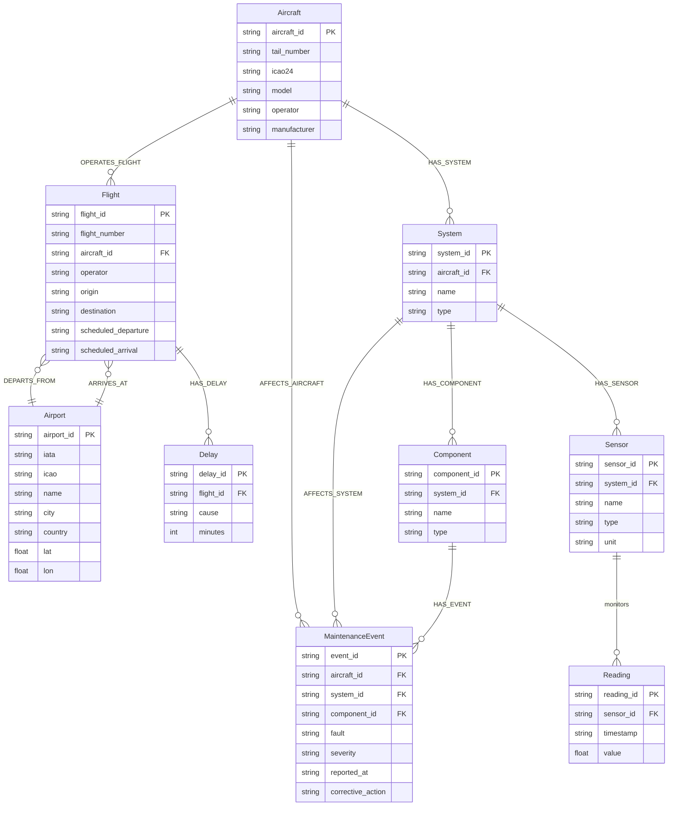
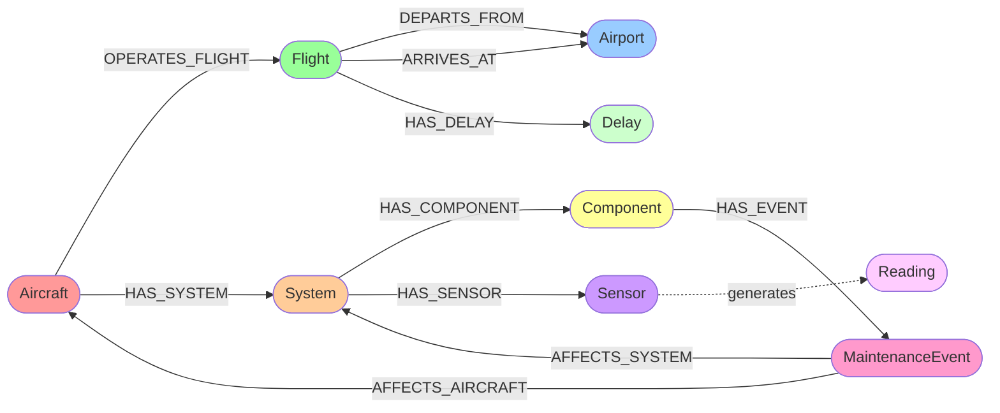

# Data Model Documentation

## Overview

The Neo4j Aviation Database models the operational and maintenance aspects of an aviation fleet. It captures aircraft, flights, airports, systems, sensors, maintenance events, and delays.

## Entity-Relationship Diagram



## Graph Schema Visualization



## Node Types

### Aircraft

Represents a commercial aircraft in the fleet.

**Properties:**
- `aircraft_id` (string) - Unique identifier
- `tail_number` (string) - Aircraft registration/tail number
- `icao24` (string) - ICAO 24-bit address
- `model` (string) - Aircraft model (e.g., "Boeing 737-800")
- `operator` (string) - Operating airline
- `manufacturer` (string) - Aircraft manufacturer

**Outgoing Relationships:**
- `OPERATES_FLIGHT` → Flight
- `HAS_SYSTEM` → System

**Incoming Relationships:**
- `AFFECTS_AIRCRAFT` ← MaintenanceEvent

**Count:** 60 nodes

### Airport

Represents an airport with location and identification codes.

**Properties:**
- `airport_id` (string) - Unique identifier
- `iata` (string) - IATA airport code (e.g., "LAX")
- `icao` (string) - ICAO airport code (e.g., "KLAX")
- `name` (string) - Airport name
- `city` (string) - City location
- `country` (string) - Country location
- `lat` (float) - Latitude coordinate
- `lon` (float) - Longitude coordinate

**Incoming Relationships:**
- `DEPARTS_FROM` ← Flight
- `ARRIVES_AT` ← Flight

**Count:** 36 nodes

### Flight

Represents a scheduled flight operation.

**Properties:**
- `flight_id` (string) - Unique identifier
- `flight_number` (string) - Flight number (e.g., "AA100")
- `aircraft_id` (string) - ID of operating aircraft
- `operator` (string) - Operating airline
- `origin` (string) - Origin airport code
- `destination` (string) - Destination airport code
- `scheduled_departure` (string) - Scheduled departure time (ISO format)
- `scheduled_arrival` (string) - Scheduled arrival time (ISO format)

**Outgoing Relationships:**
- `DEPARTS_FROM` → Airport
- `ARRIVES_AT` → Airport
- `HAS_DELAY` → Delay

**Incoming Relationships:**
- `OPERATES_FLIGHT` ← Aircraft

**Count:** 2,400 nodes

### System

Represents a major aircraft system (e.g., hydraulics, avionics, engines).

**Properties:**
- `system_id` (string) - Unique identifier
- `aircraft_id` (string) - Parent aircraft ID
- `name` (string) - System name
- `type` (string) - System type

**Outgoing Relationships:**
- `HAS_COMPONENT` → Component
- `HAS_SENSOR` → Sensor

**Incoming Relationships:**
- `HAS_SYSTEM` ← Aircraft
- `AFFECTS_SYSTEM` ← MaintenanceEvent

**Count:** 240 nodes

### Component

Represents a component within an aircraft system.

**Properties:**
- `component_id` (string) - Unique identifier
- `system_id` (string) - Parent system ID
- `name` (string) - Component name
- `type` (string) - Component type

**Outgoing Relationships:**
- `HAS_EVENT` → MaintenanceEvent

**Incoming Relationships:**
- `HAS_COMPONENT` ← System

**Count:** 960 nodes

### Sensor

Represents a sensor that monitors a system or component.

**Properties:**
- `sensor_id` (string) - Unique identifier
- `system_id` (string) - Parent system ID
- `name` (string) - Sensor name
- `type` (string) - Sensor type
- `unit` (string) - Measurement unit (e.g., "celsius", "psi")

**Incoming Relationships:**
- `HAS_SENSOR` ← System

**Related Data:**
- Generates Reading nodes (implicit relationship)

**Count:** 480 nodes

### Reading

Represents a time-series sensor reading.

**Properties:**
- `reading_id` (string) - Unique identifier
- `sensor_id` (string) - Parent sensor ID
- `timestamp` (string) - Reading timestamp (ISO format)
- `value` (float) - Sensor reading value

**Count:** 1,036,800 nodes (time-series data)

### MaintenanceEvent

Represents a maintenance event or fault report.

**Properties:**
- `event_id` (string) - Unique identifier
- `aircraft_id` (string) - Affected aircraft ID
- `system_id` (string) - Affected system ID
- `component_id` (string) - Affected component ID
- `fault` (string) - Fault description
- `severity` (string) - Severity level (e.g., "CRITICAL", "WARNING")
- `reported_at` (string) - Event timestamp (ISO format)
- `corrective_action` (string) - Action taken

**Outgoing Relationships:**
- `AFFECTS_AIRCRAFT` → Aircraft
- `AFFECTS_SYSTEM` → System

**Incoming Relationships:**
- `HAS_EVENT` ← Component

**Count:** 900 nodes

### Delay

Represents a flight delay incident.

**Properties:**
- `delay_id` (string) - Unique identifier
- `flight_id` (string) - Affected flight ID
- `cause` (string) - Delay cause
- `minutes` (integer) - Delay duration in minutes

**Incoming Relationships:**
- `HAS_DELAY` ← Flight

**Count:** 1,542 nodes

## Relationship Types

### OPERATES_FLIGHT

Connects an Aircraft to the Flights it operates.

**Direction:** Aircraft → Flight  
**Count:** 11,200 relationships  
**Cardinality:** One-to-Many (one aircraft operates many flights)

### DEPARTS_FROM / ARRIVES_AT

Connects a Flight to its departure and arrival Airports.

**Direction:** Flight → Airport  
**Count:** 11,200 each  
**Cardinality:** Many-to-One (many flights per airport)

### HAS_SYSTEM

Connects an Aircraft to its Systems.

**Direction:** Aircraft → System  
**Count:** 1,120 relationships  
**Cardinality:** One-to-Many (one aircraft has many systems)

### HAS_COMPONENT

Connects a System to its Components.

**Direction:** System → Component  
**Count:** 4,480 relationships  
**Cardinality:** One-to-Many (one system has many components)

### HAS_SENSOR

Connects a System to its Sensors.

**Direction:** System → Sensor  
**Count:** 2,240 relationships  
**Cardinality:** One-to-Many (one system has many sensors)

### HAS_EVENT

Connects a Component to MaintenanceEvents.

**Direction:** Component → MaintenanceEvent  
**Count:** 4,200 relationships  
**Cardinality:** One-to-Many (one component can have many events)

### AFFECTS_AIRCRAFT / AFFECTS_SYSTEM

Connects a MaintenanceEvent to the affected Aircraft and System.

**Direction:** MaintenanceEvent → Aircraft/System  
**Count:** 4,200 each  
**Cardinality:** Many-to-One (many events per aircraft/system)

### HAS_DELAY

Connects a Flight to its Delays.

**Direction:** Flight → Delay  
**Count:** 7,196 relationships  
**Cardinality:** One-to-Many (one flight can have multiple delays)

## Common Query Patterns

### Find All Flights for an Aircraft

```cypher
MATCH (a:Aircraft {aircraft_id: $aircraft_id})-[:OPERATES_FLIGHT]->(f:Flight)
RETURN f
ORDER BY f.scheduled_departure DESC
LIMIT 100
```

### Find All Maintenance Events for an Aircraft

```cypher
MATCH (a:Aircraft {aircraft_id: $aircraft_id})<-[:AFFECTS_AIRCRAFT]-(m:MaintenanceEvent)
RETURN m
ORDER BY m.reported_at DESC
```

### Find All Systems and Components for an Aircraft

```cypher
MATCH (a:Aircraft {aircraft_id: $aircraft_id})-[:HAS_SYSTEM]->(s:System)
OPTIONAL MATCH (s)-[:HAS_COMPONENT]->(c:Component)
RETURN s, collect(c) as components
```

### Find Recent Sensor Readings for a System

```cypher
MATCH (s:System {system_id: $system_id})-[:HAS_SENSOR]->(sensor:Sensor)
MATCH (r:Reading {sensor_id: sensor.sensor_id})
RETURN sensor, r
ORDER BY r.timestamp DESC
LIMIT 100
```

### Find Flights with Delays

```cypher
MATCH (f:Flight)-[:HAS_DELAY]->(d:Delay)
WHERE d.minutes > 30
RETURN f, d
ORDER BY d.minutes DESC
```

### Find Critical Maintenance Events

```cypher
MATCH (m:MaintenanceEvent {severity: 'CRITICAL'})
MATCH (m)-[:AFFECTS_AIRCRAFT]->(a:Aircraft)
MATCH (m)-[:AFFECTS_SYSTEM]->(s:System)
RETURN m, a, s
ORDER BY m.reported_at DESC
```

## Data Statistics

| Entity | Count | Description |
|--------|-------|-------------|
| Aircraft | 60 | Fleet size |
| Airport | 36 | Route network |
| Flight | 2,400 | Flight operations |
| System | 240 | Aircraft systems |
| Component | 960 | System components |
| Sensor | 480 | Monitoring sensors |
| Reading | 1,036,800 | Time-series data |
| MaintenanceEvent | 900 | Maintenance records |
| Delay | 1,542 | Delay incidents |

## Indexing Recommendations

For optimal query performance, consider creating indexes on:

```cypher
-- Primary identifiers
CREATE INDEX aircraft_id FOR (a:Aircraft) ON (a.aircraft_id);
CREATE INDEX airport_iata FOR (a:Airport) ON (a.iata);
CREATE INDEX flight_id FOR (f:Flight) ON (f.flight_id);
CREATE INDEX system_id FOR (s:System) ON (s.system_id);
CREATE INDEX sensor_id FOR (s:Sensor) ON (s.sensor_id);

-- Frequently queried properties
CREATE INDEX aircraft_tail FOR (a:Aircraft) ON (a.tail_number);
CREATE INDEX flight_number FOR (f:Flight) ON (f.flight_number);
CREATE INDEX event_severity FOR (m:MaintenanceEvent) ON (m.severity);

-- Time-based queries
CREATE INDEX reading_timestamp FOR (r:Reading) ON (r.timestamp);
CREATE INDEX event_reported FOR (m:MaintenanceEvent) ON (m.reported_at);
```

## Data Model Evolution

This data model can be extended to include:

- **Crew** - Flight crew assignments
- **Route** - Standard flight routes
- **Maintenance Schedule** - Planned maintenance
- **Parts Inventory** - Spare parts tracking
- **Weather** - Weather conditions affecting flights
- **Performance Metrics** - Aircraft performance data

## Summary

The aviation database schema models:

✅ **Operational Data** - Aircraft, flights, airports, delays  
✅ **Technical Data** - Systems, components, sensors, readings  
✅ **Maintenance Data** - Events, faults, corrective actions  
✅ **Relationships** - Clear connections between entities  
✅ **Scalability** - Time-series sensor data (1M+ readings)  
✅ **Query Flexibility** - Graph structure enables complex traversals  

This schema supports operational analytics, maintenance tracking, fleet management, and predictive maintenance use cases.
