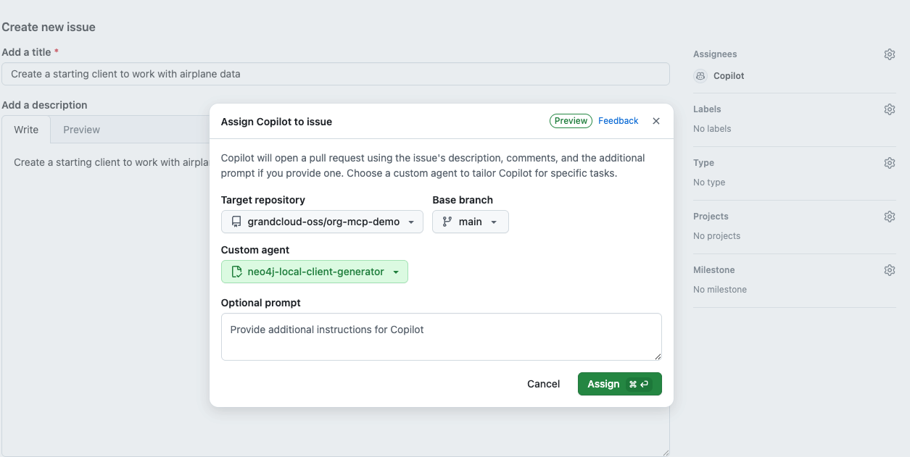
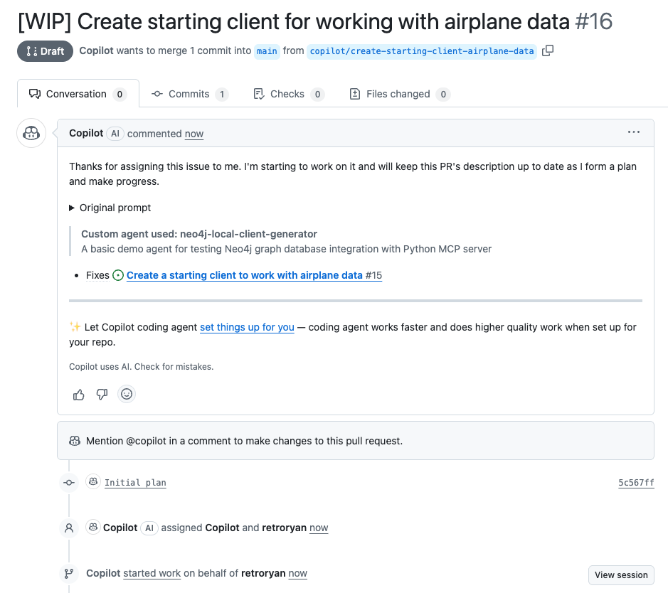
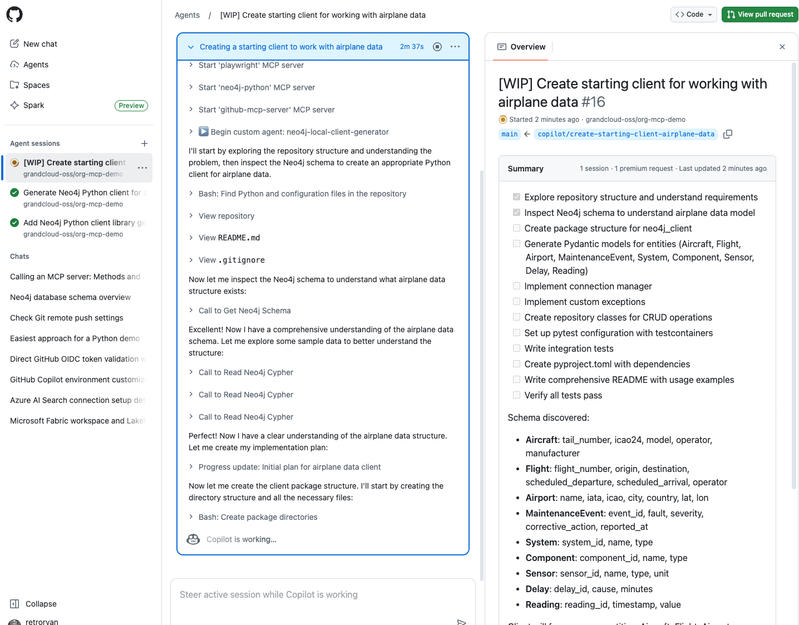
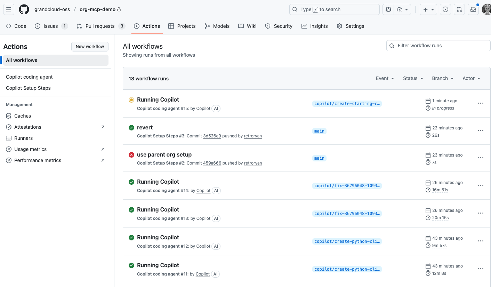

# Custom GitHub Copilot Agents with Neo4j MCP Cypher Server

This repository demonstrates how to set up custom GitHub Copilot agents that integrate with the [Neo4j MCP Cypher Server](https://github.com/neo4j-contrib/mcp-neo4j).

Specifically, this showcases a custom agent that automatically generates high-quality Python Neo4j client libraries with best practices including:
- Pydantic models for type safety
- Repository pattern for clean query organization
- Parameterized Cypher queries to prevent injection attacks
- Integration tests using testcontainers
- Modern Python packaging with pyproject.toml

**Important**: This repository contains **example agent configurations and documentation only**. The actual custom agents are deployed in the organization-level `grandcloud-oss/.github-private` repository, where they are available across all repositories in the organization.

This setup was created in the `grandcloud-oss` organization where I had administrator privileges. **Organization administrator privileges are required** to create the `.github-private` repository and configure organization-level custom agents with MCP server integrations.

## Testing MCP Servers Directly

Before creating custom agents, it can be useful to first test the [Neo4j MCP Cypher Server](https://github.com/neo4j-contrib/mcp-neo4j) directly to ensure it's working correctly. This allows you to verify connectivity and functionality independently from the agent configuration.

See the [GitHub documentation on extending the coding agent with MCP](https://docs.github.com/en/copilot/how-tos/use-copilot-agents/coding-agent/extend-coding-agent-with-mcp) for instructions on how to configure and test MCP servers locally.

This repository includes two example configurations for the Neo4j MCP Cypher Server in [`sample-mcp-config/`](sample-mcp-config/):
- [`neo4j-mcp-docker-config.json`](sample-mcp-config/neo4j-mcp-docker-config.json) - Docker-based MCP server configuration
- [`neo4j-mcp-local-config.json`](sample-mcp-config/neo4j-mcp-local-config.json) - Local Python-based MCP server configuration

## What are Custom GitHub Copilot Agents?

Custom agents extend GitHub Copilot's capabilities by providing specialized tools and domain-specific knowledge. They can be configured to use external tools, APIs, and MCP servers to perform complex tasks beyond standard code completion.

For more details on custom agents, see:
- [GitHub Copilot Custom Agents Documentation](https://docs.github.com/en/copilot/concepts/agents/coding-agent/about-custom-agents)
- [Awesome Copilot Agents Collection](https://github.com/github/awesome-copilot/tree/5cfe2e26159bcd4015ba4c8bdf18fff2a268049c/agents)

## Critical: Organization-Level Setup for MCP Servers

**IMPORTANT**: If your agent uses MCP servers, it MUST be created at the **organization level** in a **private `.github-private` repository**.

Individual repository-level agents cannot access MCP servers and will not work. **This repository does not contain the actual agents** - they must be created in your organization's `.github-private` repository.

See the official [GitHub documentation on creating custom agents](https://docs.github.com/en/copilot/how-tos/use-copilot-agents/coding-agent/create-custom-agents) for detailed setup instructions.

### Prerequisites

1. **Create a `.github-private` repository** in your organization first. This is a special private repository that GitHub uses for organization-level configurations. See the [GitHub documentation on adding a member-only organization profile README](https://docs.github.com/en/organizations/collaborating-with-groups-in-organizations/customizing-your-organizations-profile#adding-a-member-only-organization-profile-readme) for instructions on creating this repository.

2. **Organization administrator privileges** are required to create and configure the `.github-private` repository

3. **Access to organization-level settings** for environment variables and secrets

### Repository Structure

Your organization should have a `.github-private` repository with the following structure:
```
<your-org>/.github-private/
└── copilot/
    └── agents/
        ├── your-agent-1.md
        └── your-agent-2.md
```

Organization and enterprise owners can create custom agents in a `.github-private` repository that are available across all repositories within their organization or enterprise.

## Example Agents

This repository includes two example agents that demonstrate different approaches to running the [Neo4j MCP Cypher Server](https://github.com/neo4j-contrib/mcp-neo4j):

### 1. Docker-Based Agent

See [`org-setup-files/agents/neo4j-docker-client-generator.md`](org-setup-files/agents/neo4j-docker-client-generator.md)

This agent runs the Neo4j MCP Cypher Server inside a Docker container.

### 2. Python Direct Agent

See [`org-setup-files/agents/neo4j-local-client-generator.md`](org-setup-files/agents/neo4j-local-client-generator.md)

This agent runs the Neo4j MCP Cypher Server directly as a Python command.

### Agent File Layout

Each agent definition follows this structure:

```yaml
---
name: agent-name
description: Brief description of what the agent does
tools: ['read', 'edit', 'search', 'shell', 'mcp-server-name/*']
mcp-servers:
  server-name:
    type: 'local'
    command: 'command-to-run'
    args: ['arg1', 'arg2']
    env:
      VAR_NAME: '${ENVIRONMENT_VARIABLE}'
    tools: ["*"]
---

# Agent Instructions

Your agent's detailed instructions go here...
```

## Environment Variables Configuration

Getting environment variables to work correctly with MCP servers requires careful configuration. After extensive testing, this format works reliably:

### 1. Create Environment Variables at Organization Level

Create these environment variables in your GitHub organization settings:

- `COPILOT_MCP_NEO4J_URI`
- `COPILOT_MCP_NEO4J_USERNAME`
- `COPILOT_MCP_NEO4J_PASSWORD`
- `COPILOT_MCP_NEO4J_DATABASE`

**Important**: Use the `COPILOT_MCP_` prefix for all MCP-related variables.

### 2. Create Environment Variables in Repository

Also create the same environment variables at the repository level:

1. Go to Settings → Environments
2. Create an environment named `copilot`
3. Add all the same variables with their values

### 3. Configure Workflow Setup

The Python-based agent requires a GitHub Actions workflow to set up the Python environment. This is critical for agents that run the Neo4j MCP Cypher Server directly.

See [`.github/workflows/copilot-setup-steps.yml`](.github/workflows/copilot-setup-steps.yml) for the workflow configuration.

This workflow ensures that the Python environment and required Neo4j MCP Cypher Server packages are available when Copilot agents execute.

## Testing Your Custom Agent

Once your agent is configured, follow these steps to test it:

### 1. Create and Assign an Issue to Copilot

Create a new issue in your repository and assign it to Copilot.

**Important**: You must click away from the assignment dropdown after assigning to Copilot, then return to set the custom agent. The custom agent selection will not be available until you click out first.



### 2. Monitor Agent Startup

Give the agent a couple of minutes to start up. Once it begins, you'll see "Copilot started work on..." in the issue comments. Click on that link to see the status and logs.



### 3. Verify MCP Server Connection

Once started, you'll see the agent connect to Neo4j and retrieve the schema, confirming that the MCP server integration is working correctly.



### 4. View Detailed Debug Logs

You can go to the Actions tab in your repository to see detailed debug logs for each agent run.



### Example Output

For a complete example of what the agent generates, see [PR #16](https://github.com/grandcloud-oss/org-mcp-demo/pull/16) which shows a full Python Neo4j client library generated by the custom agent, including models, repository patterns, tests, and documentation.

## Summary Checklist

When setting up custom agents with MCP servers:

- [ ] Create agents in organization-level `.github-private` repository
- [ ] Define MCP server configuration with proper `command`, `args`, and `env` mapping
- [ ] Create `COPILOT_MCP_*` environment variables at organization level
- [ ] Create matching environment variables in repository settings under `copilot` environment
- [ ] Set up `.github/workflows/copilot-setup-steps.yml` for Python-based MCP servers
- [ ] Test agent with simple queries before deploying complex workflows

## Additional Resources

- [MCP Protocol Documentation](https://modelcontextprotocol.io/)
- [GitHub Copilot Extensions](https://github.com/features/copilot)
- [Neo4j MCP Server](https://github.com/neo4j-contrib/mcp-neo4j)
