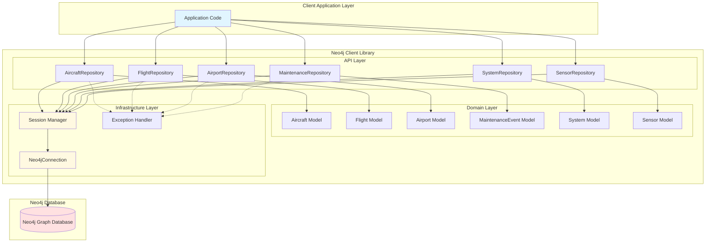
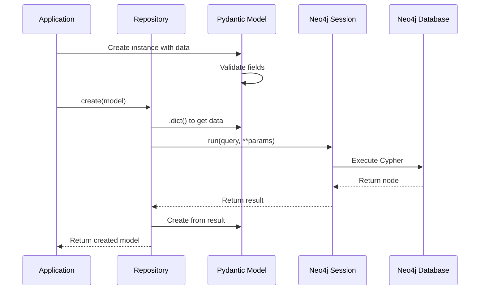
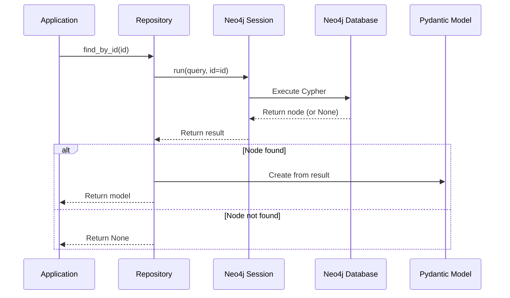
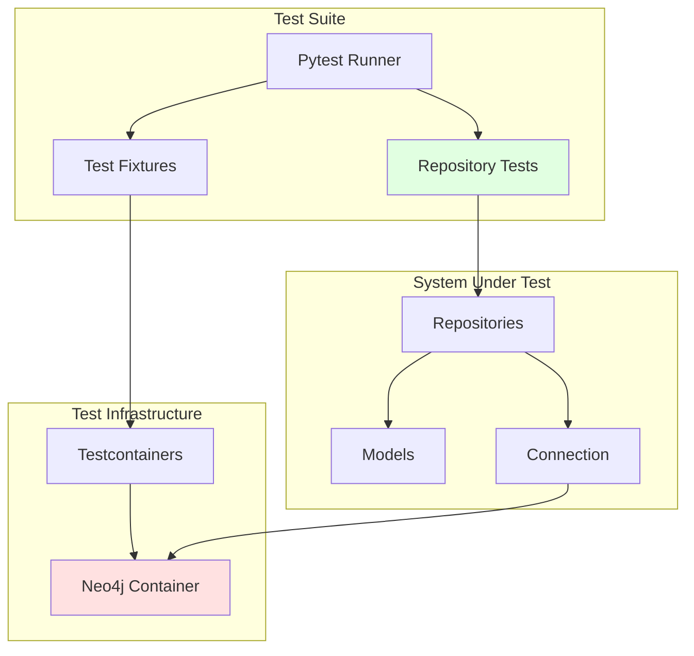

# Architecture Documentation

## Overview

The Neo4j Aviation Client is built using a **layered architecture** with clear separation of concerns. This design promotes maintainability, testability, and extensibility.

## Architecture Diagram



## Component Layers

### 1. Client Application Layer

The application layer represents user code that consumes the library. This layer:
- Imports repository and model classes
- Manages connection lifecycle
- Orchestrates business logic
- Handles application-specific error scenarios

### 2. API Layer (Repositories)

The repository layer provides a clean, type-safe API for database operations:

**Responsibilities:**
- Implement CRUD operations for each entity type
- Construct parameterized Cypher queries
- Transform database results into Pydantic models
- Provide domain-specific query methods
- Handle repository-level error cases

**Pattern:** Repository Pattern
- One repository class per entity type
- Consistent method naming (`create`, `find_by_id`, `find_all`, etc.)
- Returns strongly-typed domain models

### 3. Domain Layer (Models)

The domain layer contains Pydantic models representing business entities:

**Responsibilities:**
- Define entity structure with type hints
- Validate input data automatically
- Provide serialization/deserialization
- Document field meanings and constraints

**Pattern:** Domain Model Pattern
- Immutable by design (Pydantic models)
- Self-validating
- Framework-agnostic

### 4. Infrastructure Layer

The infrastructure layer handles low-level concerns:

**Neo4jConnection:**
- Manages Neo4j driver lifecycle
- Provides connection pooling
- Implements context manager protocol
- Verifies connectivity

**Session Manager:**
- Creates and manages database sessions
- Ensures proper resource cleanup
- Handles session-level configuration

**Exception Handler:**
- Provides custom exception hierarchy
- Wraps Neo4j driver exceptions
- Enables application-level error handling

## Design Patterns

### Repository Pattern

Each entity type has a dedicated repository class that encapsulates all database operations:

```python
class AircraftRepository:
    def __init__(self, session: Session):
        self.session = session
    
    def create(self, aircraft: Aircraft) -> Aircraft:
        # Encapsulates Cypher query
        # Returns domain model
        pass
    
    def find_by_id(self, id: str) -> Optional[Aircraft]:
        # Type-safe query method
        pass
```

**Benefits:**
- Single responsibility - each repository manages one entity
- Testability - easy to mock repositories
- Consistency - uniform interface across entities

### Dependency Injection

Repositories receive their session dependency via constructor injection:

```python
# Explicit dependency
repo = AircraftRepository(session)
```

**Benefits:**
- Testable - easy to inject mock sessions
- Flexible - session configuration externalized
- Clear - dependencies are explicit

### Context Manager Pattern

Connection management uses Python's context manager protocol:

```python
with Neo4jConnection(uri, user, password) as conn:
    session = conn.get_session()
    # Use session
    # Automatic cleanup on exit
```

**Benefits:**
- Resource safety - guaranteed cleanup
- Pythonic - follows Python conventions
- Simple - reduces boilerplate

## Data Flow

### Create Operation



### Query Operation



## Security Architecture

### Query Parameterization

All queries use named parameters to prevent injection attacks:

```python
# SECURE: Parameterized query
query = "MATCH (a:Aircraft {aircraft_id: $aircraft_id}) RETURN a"
session.run(query, aircraft_id=user_input)

# INSECURE: String interpolation (NOT USED)
# query = f"MATCH (a:Aircraft {{aircraft_id: '{user_input}'}}) RETURN a"
```

### Input Validation

Pydantic models validate all inputs before database operations:

```python
class Aircraft(BaseModel):
    aircraft_id: str  # Required, must be string
    tail_number: str  # Required, must be string
    lat: float        # Required, must be float
    # Invalid types raise ValidationError
```

### Error Handling

Custom exception hierarchy provides security through controlled error exposure:

```python
try:
    aircraft = repo.find_by_id(id)
except Neo4jClientError as e:
    # Application-level error (safe to log)
    log.error(f"Client error: {e}")
except Exception as e:
    # Unexpected error (may contain sensitive info)
    log.error("Internal error")
```

## Testing Architecture



### Test Strategy

**Integration Tests:**
- Use testcontainers to spin up real Neo4j instance
- Test actual database operations
- Verify Cypher query correctness
- Ensure data integrity

**Fixture Strategy:**
- Session-scoped container (reuse across tests)
- Function-scoped sessions (isolation per test)
- Automatic cleanup after each test

## Extension Points

The architecture is designed for extensibility:

### 1. Adding New Entities

```python
# 1. Create model in models.py
class NewEntity(BaseModel):
    id: str
    name: str

# 2. Create repository in repository.py
class NewEntityRepository:
    def __init__(self, session: Session):
        self.session = session
    
    def create(self, entity: NewEntity) -> NewEntity:
        # Implementation
        pass

# 3. Export in __init__.py
```

### 2. Adding Relationship Methods

```python
class AircraftRepository:
    def get_flights(self, aircraft_id: str) -> List[Flight]:
        """Traverse OPERATES_FLIGHT relationship."""
        query = """
        MATCH (a:Aircraft {aircraft_id: $aircraft_id})-[:OPERATES_FLIGHT]->(f:Flight)
        RETURN f
        """
        result = self.session.run(query, aircraft_id=aircraft_id)
        return [Flight(**record["f"]) for record in result]
```

### 3. Adding Aggregations

```python
class FlightRepository:
    def count_by_operator(self, operator: str) -> int:
        """Count flights by operator."""
        query = """
        MATCH (f:Flight {operator: $operator})
        RETURN count(f) as total
        """
        result = self.session.run(query, operator=operator)
        record = result.single()
        return record["total"] if record else 0
```

## Performance Considerations

### Connection Pooling

The Neo4j driver handles connection pooling automatically:
- Reuse connections across sessions
- Configure pool size via driver config
- Monitor pool metrics

### Query Optimization

For better performance:
- Add indexes on frequently queried properties
- Use query profiling (`EXPLAIN`, `PROFILE`)
- Limit result sets with `LIMIT` clause
- Use relationship direction in queries

### Batch Operations

For bulk operations, consider adding batch methods:

```python
def create_many(self, entities: List[Aircraft]) -> List[Aircraft]:
    """Batch create multiple aircraft."""
    query = """
    UNWIND $batch as item
    MERGE (a:Aircraft {aircraft_id: item.aircraft_id})
    SET a = item
    RETURN a
    """
    batch = [entity.dict() for entity in entities]
    result = self.session.run(query, batch=batch)
    return [Aircraft(**record["a"]) for record in result]
```

## Dependencies

### Core Dependencies

- **neo4j** (>=5.13.0) - Official Neo4j Python driver
- **pydantic** (>=2.0.0) - Data validation and settings management

### Development Dependencies

- **pytest** (>=7.4.0) - Testing framework
- **testcontainers** (>=3.7.0) - Docker-based test infrastructure
- **pytest-cov** (>=4.1.0) - Coverage reporting

## Configuration

The client uses environment-based configuration:

```python
import os
from neo4j_client import Neo4jConnection

conn = Neo4jConnection(
    uri=os.getenv("NEO4J_URI", "bolt://localhost:7687"),
    username=os.getenv("NEO4J_USERNAME", "neo4j"),
    password=os.getenv("NEO4J_PASSWORD"),
    database=os.getenv("NEO4J_DATABASE", "neo4j")
)
```

## Summary

This architecture provides:

✅ **Separation of Concerns** - Clear layer boundaries  
✅ **Type Safety** - Comprehensive type hints and validation  
✅ **Testability** - Easy to test with dependency injection  
✅ **Security** - Parameterized queries and input validation  
✅ **Extensibility** - Simple to add new features  
✅ **Maintainability** - Consistent patterns throughout  
✅ **Performance** - Connection pooling and query optimization  

The design prioritizes simplicity and clarity while following Python best practices and security guidelines.
